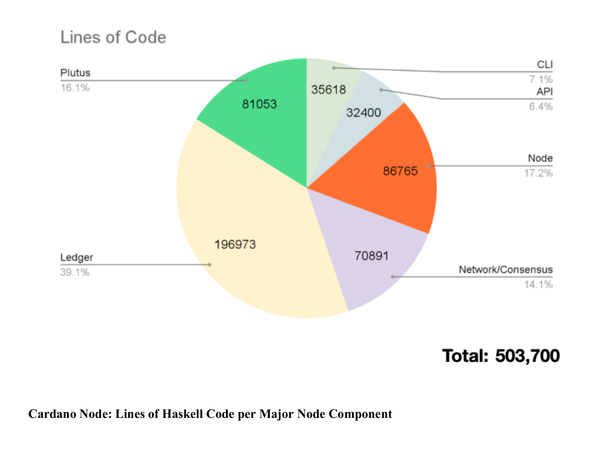

# Introduction to the Cardano Node

The Cardano blockchain represents a state-of-the-art top-10 blockchain, offering enviable robustness and reliability guarantees, as well as novel smart contract and governance capabilities. It has been built over a period of 7+ years using a unique combination of academic research, carefully translated into an executable form, with lightweight formal methods used to ensure high levels of conformance with a formally defined and precise specification.

The Cardano blockchain is powered by a flock of interconnected nodes. This lecture will provide an introductory overview of what the Cardano node is, its main features and requirements, and how its codebase is structured. This birds-eye overview will help us understand the whole before getting into each component individually in future lectures.

## 1. What is the Cardano Node?

The Cardano node is the core software component that powers the Cardano blockchain network. It is responsible for maintaining the distributed ledger, validating and producing blocks, and facilitating communication between different participants in the network.

At the heart of the Cardano node is the Ouroboros consensus protocol—a peer-reviewed, provably secure proof-of-stake (PoS) mechanism. Ouroboros ensures that the network remains decentralized, energy-efficient, and secure, while enabling ADA holders to participate in staking and governance. However, there's a lot more to the node than just the consensus protocol.

## 2. Node Components

The node itself is made out of several interconnected components:

- **The settlement layer (also known as Ledger):** A multi-era ledger implementation derived from a set of formal specifications. This is where the core Cardano entities are defined as well as the *rules* for using them. This is the *bedrock* on top of which all other components build upon.
- **The consensus layer:** An implementation of the consensus layer of the *Ouroboros family* of protocols. This layer is responsible for both running the blockchain consensus protocol and maintaining all the state required to make such decisions. If you've heard about "The Hard-Fork Combinator", this is where you can find it.
- **The networking layer:** A peer-to-peer networking stack geared towards Proof-of-Stake systems. This includes a framework for writing *typed protocols* with support for pipelining, multiplexing, and various protections against adversarial peers.
- **The scripting layer (also known as Plutus):** A scripting language embedded in the Cardano ledger to provide *smart-contract capabilities* to the network. At its core, it is a typed lambda calculus that acts as low-level interpreted assembly code.

The Cardano node is a complex piece of software built upon layers of cutting-edge research. Due to this complexity, we will dedicate a separate lecture to explain each component (and how implementing it in Haskell affected it) to do them justice.

## 3. Code Breakdown

As a practical overview, the Cardano node is written in **Haskell**. Overall, it is **~500K lines of validated and certified code**. Critical code is validated by ensuring strict conformance to a **formal specification** that is written in Agda.

Of those ~500K lines of Haskell code, the lines of code per major component look roughly like this:

Of course, having more or fewer lines of code does not necessarily mean that a component is more or less complex or important. Every component is needed for the Cardano node to be a useful piece of software that delivers on its intended objective.

As a final section, here's a small overview of some advantages of using Haskell that are shared by all node components.

## 4. Advantages of using Haskell that apply to all components

Some advantages of using Haskell that apply to all components include:

- **Terse language:** 500K lines for the whole system is a relatively **compact code**. Reducing maintenance surface area.
- **Low bug incidence:** Roughly 1 bug per 3,000 lines per year of development (measured by GitHub issues).
- **Good code modularity and composability:** This greatly simplifies how different components interact with each other and how the code inside each component is organized.
- **Good verification and validation support:** Haskell's strong static typing, type-level programming, and purity allow for an easier verification and validation of our assumptions and the system's behaviour.
- **Predictability/repeatability:** Thanks to pure functions, we can predict how parts of the system will behave and reproduce results consistently.
- **Capture complex patterns:** Higher-order functions allow our engineers to directly capture complex software patterns.
- **Good support for long-term maintainability:** Strong static typing and purity also mean that code refactoring (which happens frequently in the Node codebase) is significantly easier since the developer just needs to follow the compiler.
- **Haskell attracts high-calibre functional programmers**: Haskell's core tenets of purity, static typing, and higher-order functions act as a powerful filter, drawing in programmers who prioritize mathematical precision, the creation of abstract and generalized solutions, and code that exhibits inherent elegance and correctness. This inherent selection mechanism fosters a community composed of exceptionally skilled individuals, often possessing a deep understanding of functional programming paradigms and the intricacies of system-level development.

These are already strong reasons why we have a Cardano node that has run without any major interruption for over 7 years, meeting strong real-time security requirements, and supporting a hugely decentralized worldwide network of block producers and users. However, on top of these ones, each component utilized Haskell's unique strengths in different ways. So, make sure to explore each component to discover how it works and how Haskell impacted their development.

---

**More information:**

- [Cardano Docs: Cardano Node](https://docs.cardano.org/about-cardano/learn/cardano-node/)
- [Cardano Developer Portal: Introduction to Cardano](https://developers.cardano.org/docs/operate-a-stake-pool/introduction-to-cardano/)
- [Intersect: Node 9.0 Release](https://www.intersectmbo.org/news/node-9.0-enabling-a-new-era-of-decentralized-governance-on-cardano)
- [Essential Cardano: Ouroboros Genesis Update](https://www.essentialcardano.io/article/ouroboros-genesis-design-update)
- [Introduction to the design of the Data Diffusion and Networking for Cardano Shelley](https://ouroboros-network.cardano.intersectmbo.org/pdfs/network-design/network-design.pdf)
