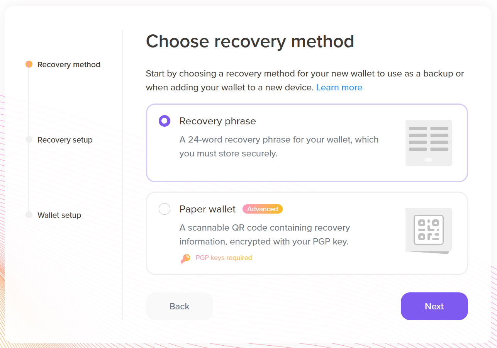

# 2.2 How to set up a new Lace wallet

Once Lace is installed as a browser extension, open the wallet from your *Extensions* settings page. The following screen will appear:  


Lace provides us with three options:  

* To create a new Cardano wallet  
* To connect a hardware wallet, such as Trezor or Ledger  
* To restore a Cardano wallet from the secret seed phrase.

Choosing any of the three options means you agree to Lace’s terms of service and privacy policy. You can view the documents by clicking the links in the notification text at the bottom. Click **Create**. The recovery method option appears.



Choose whether to generate a 24-word recovery phrase or a scannable QR code encrypted with a [PGP key](https://simple.wikipedia.org/wiki/Pretty_Good_Privacy). In this tutorial, we will select the recovery phrase. Click **Next** to create your recovery phrase.


In the image above, the recovery phrase is hidden. Write down the recovery phrase on durable paper or a metal crypto wallet. For paper, it is recommended to make two copies and store them in two separate, safe locations. It is not recommended to use the *copy to clipboard* option. If you have malware installed that accesses your clipboard and shares this data with a remote computer, the seed could be leaked. If you are using this feature, Lace provides a link to the [best practices guide](https://www.lace.io/faq?question=best-practices-for-using-the-copy-to-clipboard-paste-from-clipboard-recovery-phrase-features) for safe usage of the clipboard feature. Click **Next** and the window for entering the recovery phrase appears.


When typing in the recovery phrase words, use the **Tab** key to autocomplete a single word. As mentioned in the *Key generation for wallets* section from lesson one, the first four letters unambiguously define a seed word. After entering the last word, Lace will check if the last word, which contains the checksum of previously input data, is correct. Then, click **Next** and the wallet setup window appears.


You can set a wallet name and you will need to create a password. When entering the password, a progress bar will appear to indicate its strength. If the password is too weak, Lace will not allow you to set up your wallet. The password must then be reentered. After that, you can click **Open wallet**, and the main page of the Lace wallet will appear.


You can now see the main wallet screen, which displays your current balance and a welcome message. The page also shows the wallet address, which in our case is:

```shell
addr1qyh8v5qqcqfhfpkv8sxjxulw09m24r3ac6uns49cpwfndy0tdewcc2l3v2reur6jl2amk2jnfr6klgjjlyx29qpd0e0qtv4mld
```

You can also use the scannable QR code to get your address. Close Lace and try to reopen it from the browser’s *Extensions* menu. The following window will appear:


You can use your wallet in this format, or expand it to full screen by clicking the four arrows. Sometimes, when opening the wallet, a notification appears that provides information about a new version.


