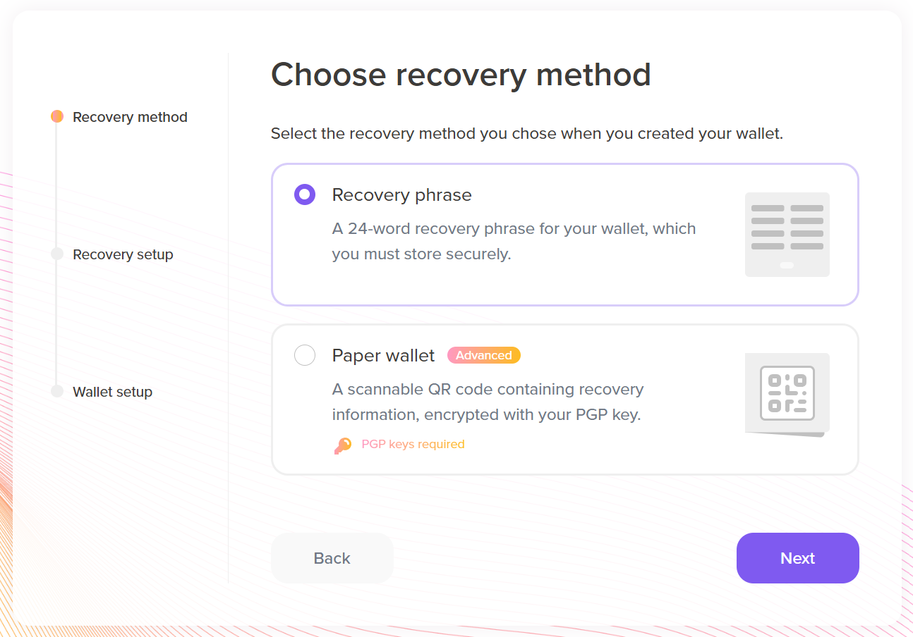
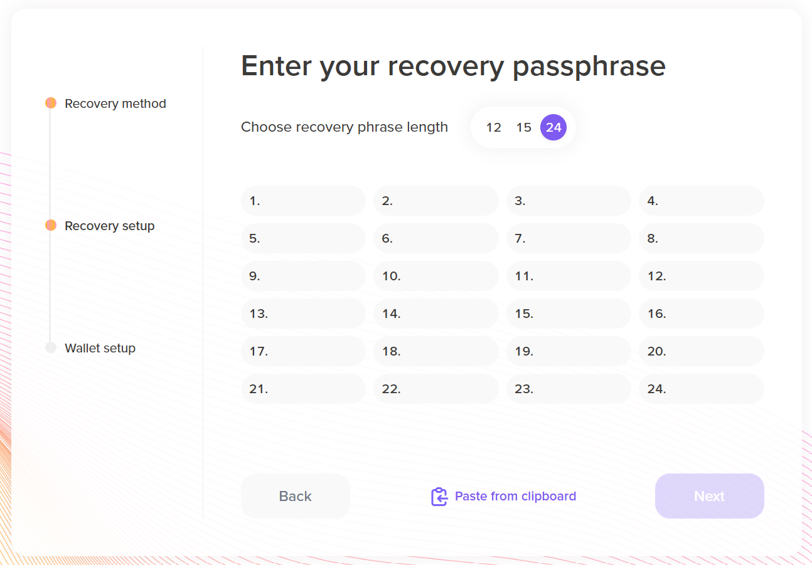
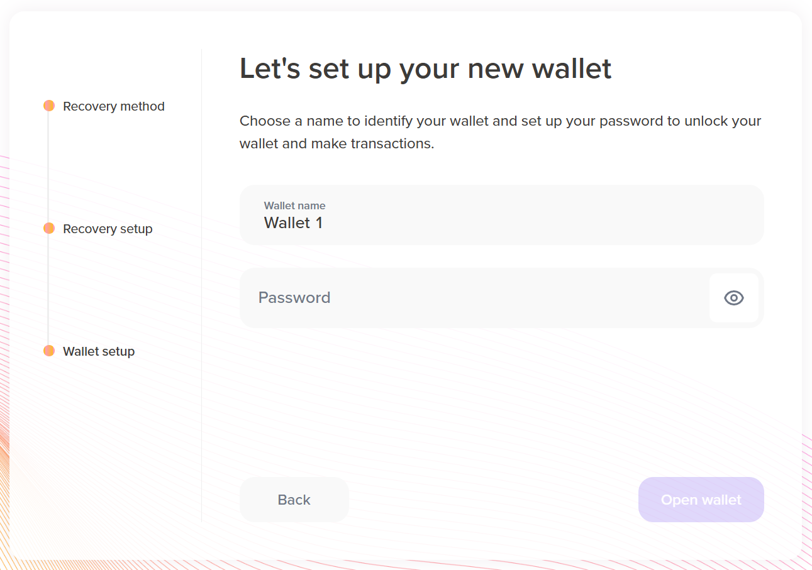
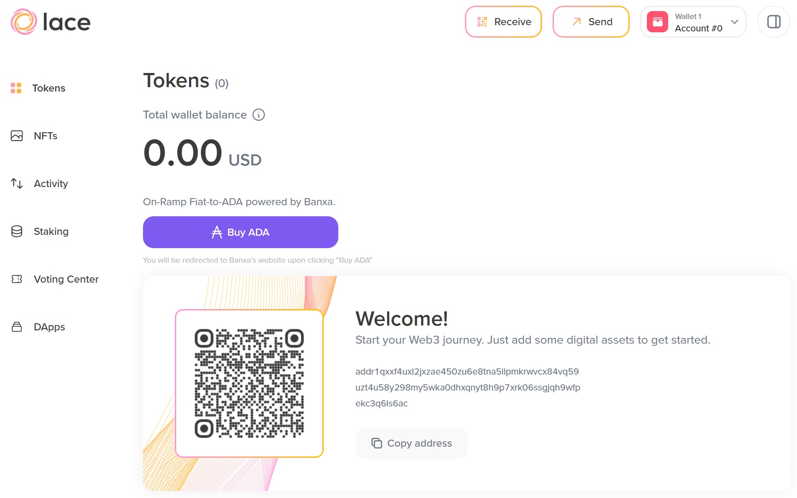

# 2.3 Restoring an existing wallet

After installing the Lace extension, you have the option to restore an existing wallet. If you click **Restore** on the introduction screen, you can choose to restore your wallet from either a recovery phrase or a paper wallet. This section explains how to restore it from a recovery phrase.



After clicking **Next**, a window appears to select the password length and enter the seed phrase.



Type in your recovery phrase. The process is the same as outlined earlier. Then, click **Next**, and the wallet setup window appears.  



Give your wallet a name and set up a password. When entering the password, a progress bar will appear to indicate its strength. Choose a strong password and proceed by clicking **Open wallet**.



You can now view the main wallet screen, which displays your current balance and a welcome message. The page also shows the wallet address, which in our case is:

```shell
addr1qyh8v5qqcqfhfpkv8sxjxulw09m24r3ac6uns49cpwfndy0tdewcc2l3v2reur6jl2amk2jnfr6klgjjlyx29qpd0e0qtv4mld
```

You can also scan the QR code to get your address. In the next lesson, we will demonstrate how to receive and send some test ada.
