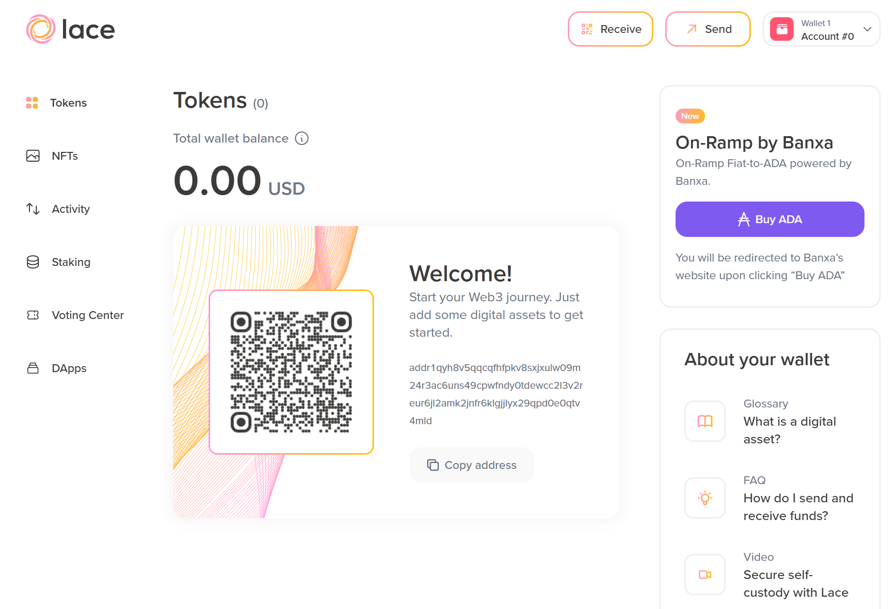

# 3.1 Lace main page

The main window, which opens by default, displays the *Tokens* view. You can see your total wallet balance in USD. The wallet’s address, which you can copy by clicking **Copy address**, is displayed in the middle of the page.

Once you receive some ada, the *Welcome* screen will disappear. Additionally, the **Buy ADA** button is available. This button redirects to an external exchange where you can purchase ada. There are currently six views you can choose from:

* Tokens  
* NFTs
* Activity  
* Staking  
* Voting center  
* DApps.

In this lesson, we will cover *Tokens* and *Activity*, and discuss other views in the following lessons. Note that you can also see the **Receive** and **Send** buttons, followed by a drop-down menu for Lace settings, which displays the wallet name and current account number.

In the top right corner, you can see the information button, which displays useful links to Lace pages, including the glossary, frequently asked questions, and educational video material. When viewing the Lace wallet on a larger screen, this information is displayed by default on the right side. Also, the **Buy ADA** button shifts to the same side.  

The information button displays information about the active window. We will go through some of this information when we cover other views.
