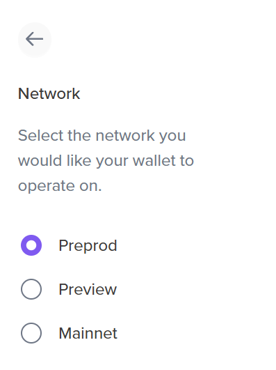
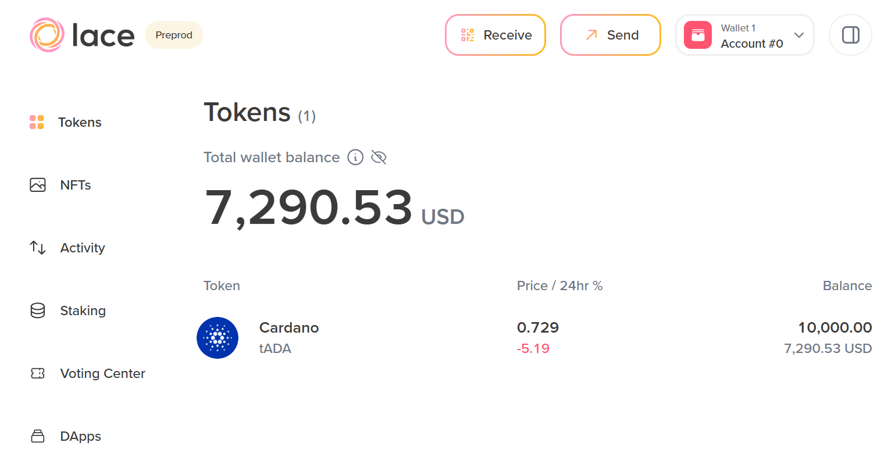
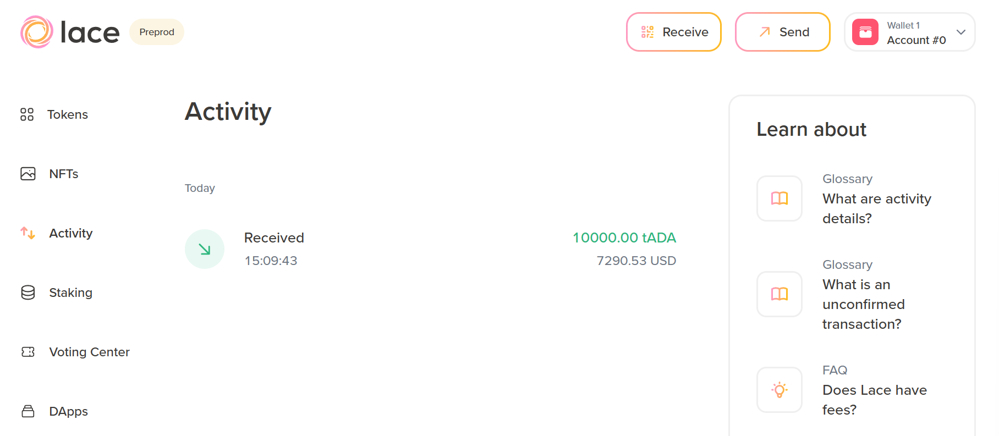

# 3.2 Requesting funds from the Cardano faucet

There are two test networks used for testing Cardano upgrades and applications developed by Cardano builders: **preview network** and **pre-production network (preprod)**. The preview network is where updates are first tested, and its parameters (epoch time, for example) differ from the main network. We will explain this term in the staking lesson. After certain functionality is well-tested, final tests are conducted on the pre-production network, which mimics the main network as closely as possible.

For both test networks, you can request test ada from the [Cardano faucet](https://docs.cardano.org/cardano-testnets/tools/faucet).

The preview network is displayed by default, so select the preprod network. Note that since Lace is set to the main network by default, you should first switch it to the preprod network to obtain your preprod address. To do this, click the **Settings** button, which displays the wallet name and account number on the top bar, located on the right side. The wallet settings panel opens on the right side, as shown in the image below.

At the bottom of the information panel, the **Network** indicates **Mainnet**. Click and select **Preprod**.

The wallet address in the main window changes. It now starts with the prefix: `addr_test`. Copy your address and enter it into the *Address* field of the Cardano faucet. Leave the *API key* field empty. Next, click the reCAPTCHA checkbox and request some test ada by clicking **Request funds**. A confirmation message should appear indicating that the transaction was successful.

The image above explains that once you are done with testing, you can send your test ada back to the preprod or preview faucet addresses.

Now, recheck your Lace homepage. It should now display your requested test ada in USD. Below, you can also view the latest price and your ada balance. By default, the Cardano faucet sends 10.000 test ada. You can request more, but you will need to wait for a certain amount of time before requesting funds again. There is also an option to bypass rate limiting with an API key, which can be useful for developers.

  

Click **Activity** to see the list of processed transactions. Currently, it displays only the receiving transaction from the Cardano faucet.

If you click on the received transaction, a side panel opens, providing more details about the transaction. It displays the transaction ID (hash), the received amount, the sender's address, the transaction timestamp, and the transaction fee paid. It is also possible to view the inputs and outputs of the transaction.  

To understand inputs and outputs, it is essential to have a basic understanding of the Extended UTXO model that Cardano uses. It is an extension of the UTXO model used by Bitcoin. For more information refer to the [Cardano documentation](https://docs.cardano.org/about-cardano/learn/eutxo-explainer), [EUTXO handbook](https://ucarecdn.com/3da33f2f-73ac-4c9b-844b-f215dcce0628/EUTXOhandbook_for_EC.pdf) or the [EUTXO chapter](https://github.com/input-output-hk/mastering-cardano/blob/main/chapters/chapter-04-how-cardano-works/chapter-utxo.adoc) in the Mastering Cardano book.
