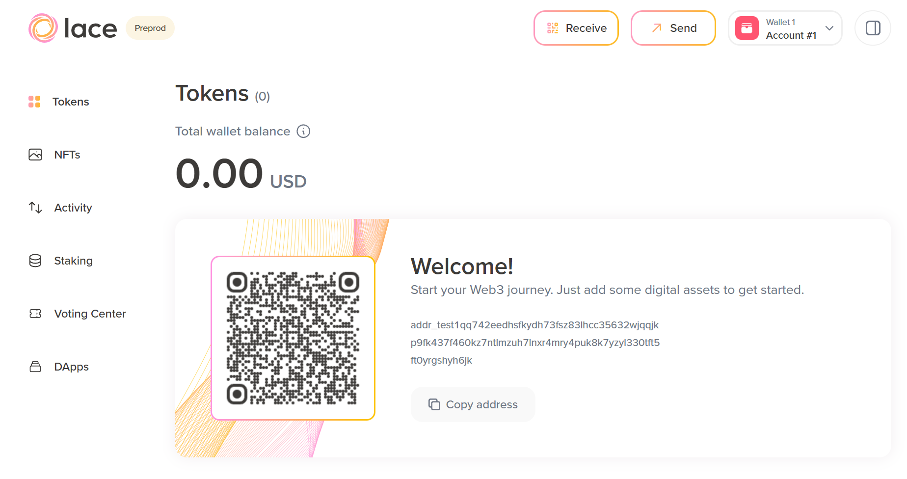
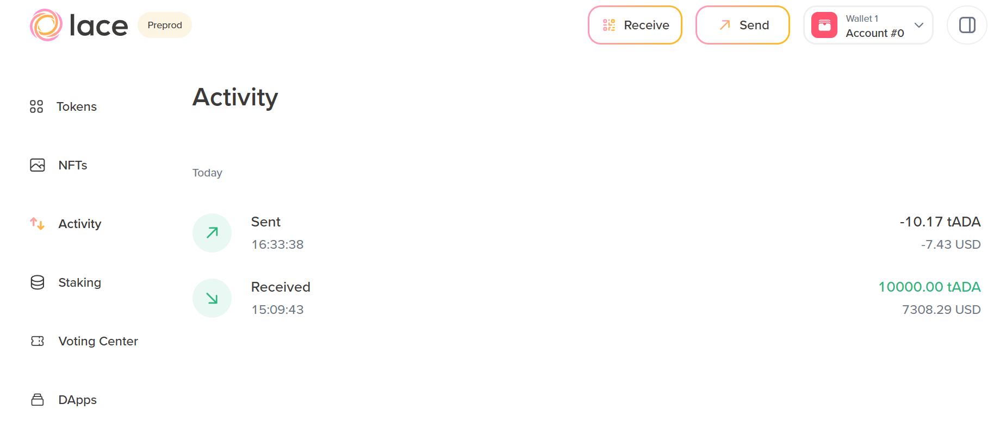
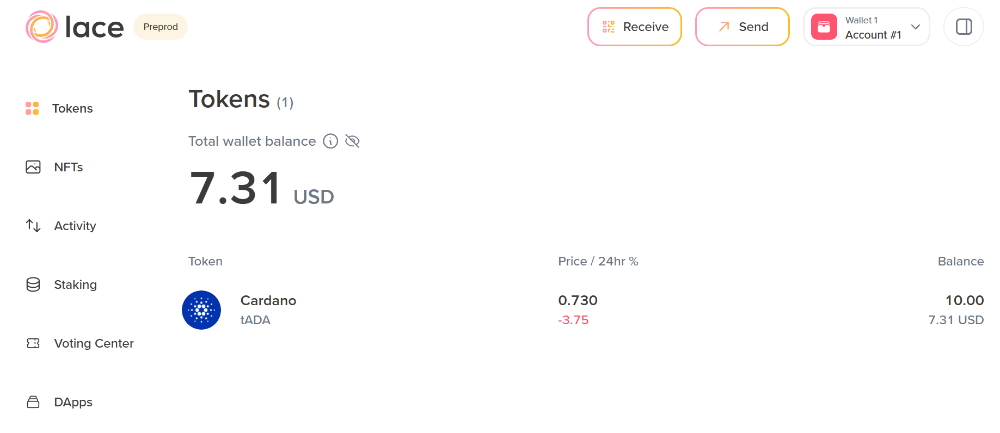

# 3.3 Sending test ada to another address

Now that you have test ada, you can send it to another address. Lace allows for multiple accounts to be stored in a single wallet, each with a unique address. You can try sending some test ada from one address to another.

By default, only account #0 is activated. To activate account #1, click the **Settings** button in the top right corner and select the `>` symbol in the panel that opens. A list of inactive accounts is displayed. Click **Enable** next to account #1. The wallet will prompt you to input your password.


After that, your Lace homepage will display a new address with a balance of 0.00 USD.



The new address is now:

```shell
addr_test1qq742eedhsfkydh73fsz83lhcc35632wjqqjkp9fk437f460kz7ntlmzuh7lnxr4mry4puk8k7yzyl330tft5ft0yrgshyh6jk
```

Copy that address, click the **Settings** button and the `>` sign. From the list of accounts, click  **account #0**. You will now see your previous balance of 10.000 test ada on the *Tokens* view. Click **Send** at the top.


The send panel appears. Enter the copied address of account #1 and indicate the amount of ada to send to that address (eg, 10 test ada). There is also an option to add a note to the transaction, with a maximum of 160 characters. After entering the transaction details, click **Review transaction**.


A transaction summary then appears. Review it and click **Confirm**. Enter your password when prompted and click **Confirm** again. After that, a confirmation message should appear, and you will be able to view the transaction.


Clicking **View transaction** takes you to the **Activity** view, where you will see your transaction –  10.17 test ada sent. The 0.17 test ada is the transaction fee.



You can now switch to account #1 and see that you have received 10 test ada. A block time is 20 seconds in Cardano, and the wallet also needs some time to sync with the server that provides blockchain data for Lace.



To view transaction details, click the transaction hash, which will open the [Cexplorer](https://cexplorer.io/) page.

Note that even though we have sent test ada to an address that also resides in our wallet, the transaction was broadcast on the pre-production Cardano test network and was successfully processed by Cardano nodes running on this test network.
