# 3. Simple transactions and settings 

This lesson describes the Lace wallet’s settings and explains how to use Lace to receive and send some test ada. Cardano has several networks, but only one - the mainnet - contains real ada. Other networks exist for testing purposes and contain *test ada,* which has no value and can be requested from the Cardano faucet for free. The functionality that Lace offers for test ada is the same as for real ada. 

## 3.1 Lace main page 

The main window, which opens by default, displays the *Tokens* view. You can see your total wallet balance in USD. The wallet’s address, which you can copy by clicking **Copy address**, is displayed in the middle of the page. 

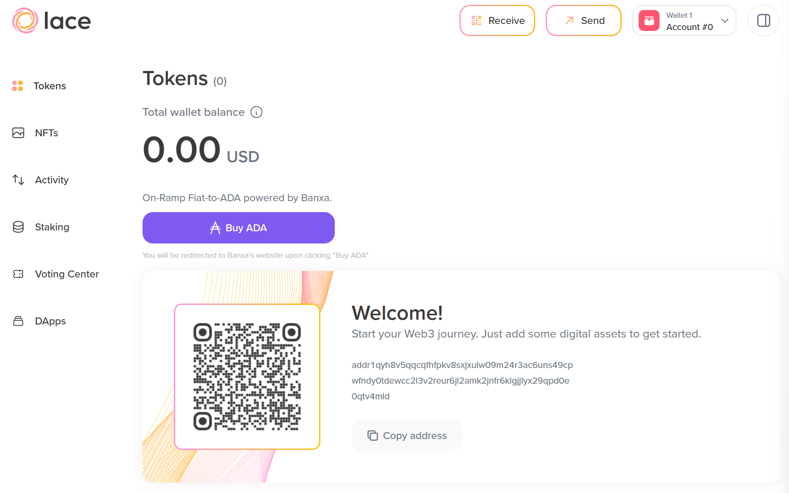

Once you receive some ada, the *Welcome* screen will disappear. Additionally, the **Buy ADA** button is available. This button redirects to an external exchange where you can purchase ada. There are currently six views you can choose from: 

* Tokens  
* NFTs
* Activity  
* Staking  
* Voting center  
* DApps.

In this lesson, we will cover *Tokens* and *Activity*, and discuss other views in the following lessons. Note that you can also see the **Receive** and **Send** buttons, followed by a drop-down menu for Lace settings, which displays the wallet name and current account number. 

In the top right corner, you can see the information button, which displays useful links to Lace pages, including the glossary, frequently asked questions, and educational video material. When viewing the Lace wallet on a larger screen, this information is displayed by default on the right side. Also, the **Buy ADA** button shifts to the same side.  

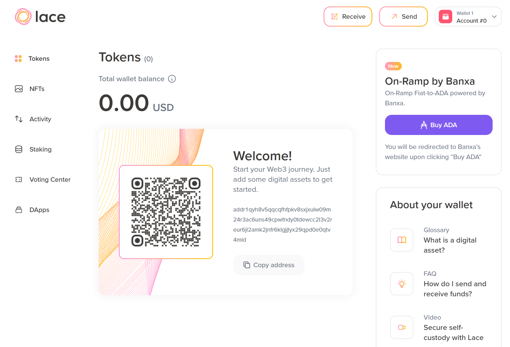

The information button displays information about the active window. We will go through some of this information when we cover other views. 

## 3.2 Requesting funds from the Cardano faucet

There are two test networks used for testing Cardano upgrades and applications developed by Cardano builders: **preview network** and **pre-production network (preprod)**. The preview network is where updates are first tested, and its parameters (epoch time, for example) differ from the main network. We will explain this term in the staking lesson. After certain functionality is well-tested, final tests are conducted on the pre-production network, which mimics the main network as closely as possible. 

For both networks, you can request test ada from the [Cardano faucet](https://docs.cardano.org/cardano-testnets/tools/faucet).   

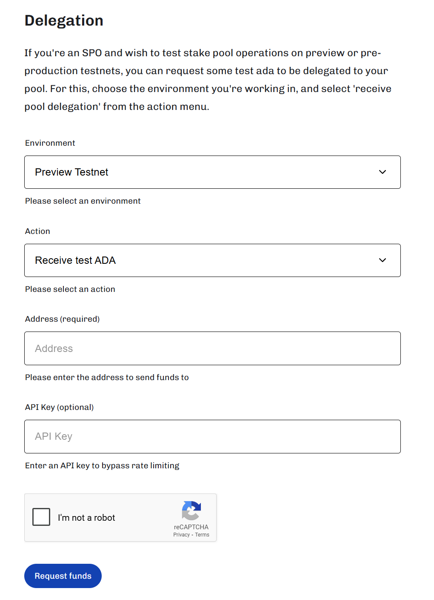

The preview network is displayed by default, so select the preprod network. Note that since Lace is set to the main network by default, you should first switch it to the preprod network to obtain your preprod address. To do this, click the **Settings** button, which displays the wallet name and account number on the top bar, located on the right side. The wallet settings panel opens on the right side, as shown in the image below. 

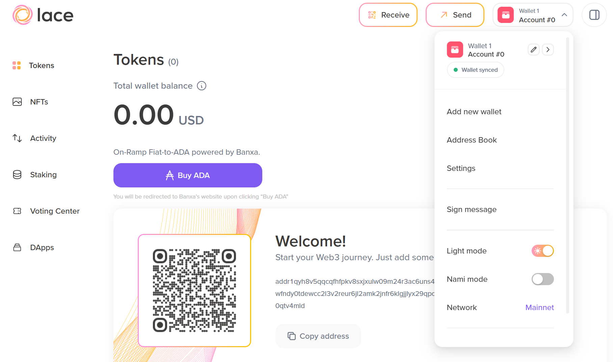

At the bottom of the information panel, the **Network** indicates **Mainnet**. Click and select **Preprod**.

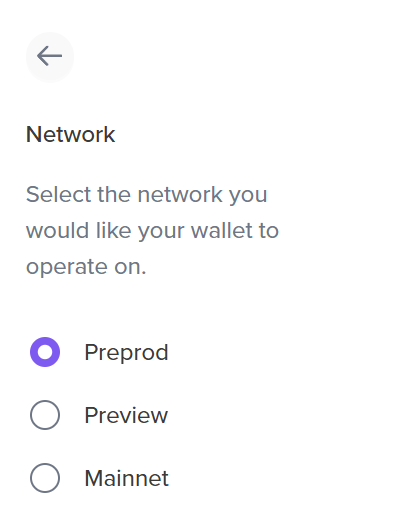

The wallet address in the main window changes. It now starts with the prefix: addr_test. Copy your address and enter it into the **Address** field of the Cardano faucet. Leave the *API key* field empty. Next, click the **reCAPTCHA checkbox** and request some test ada by clicking **Request funds**. A confirmation message should appear indicating that the transaction was successful. 

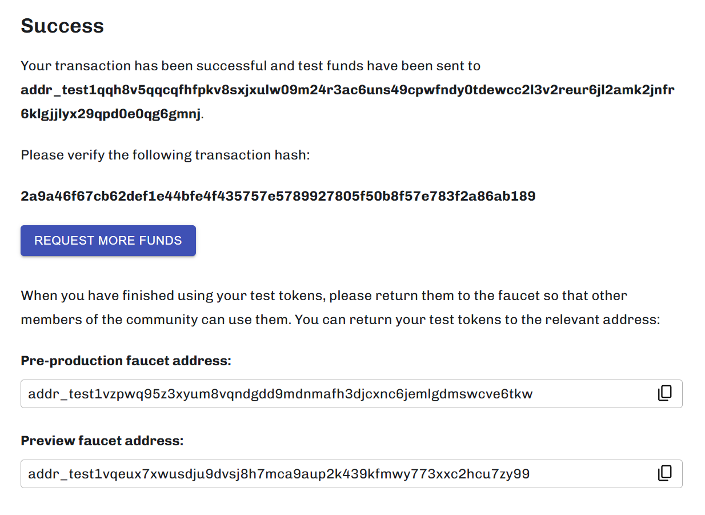

The image above explains that once you are done with testing, you can send your test ada back to the preprod or preview faucet addresses. 

Now, recheck your Lace homepage. It should now display your requested test ada in USD. Below, you can also view the latest price and your ada balance. By default, the Cardano faucet sends 10.000 test ada. You can request more, but you will need to wait for a certain amount of time before requesting funds again. There is also an option to bypass rate limiting with an API key, which can be useful for developers. 

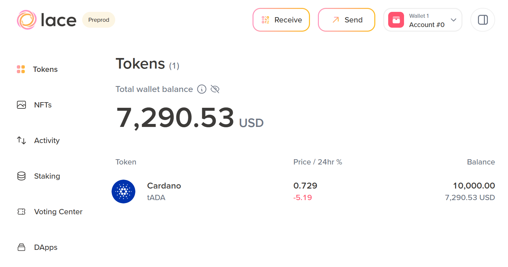  

Click **Activity** to see the list of processed transactions. Currently, it displays only the receiving transaction from the Cardano faucet. 

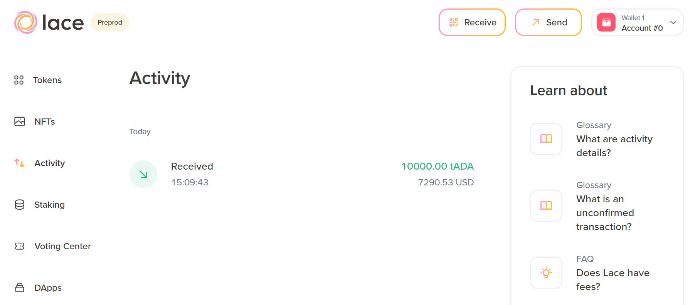

If you click on the received transaction, a side panel opens, providing more details about the transaction. It displays the transaction ID (hash), the received amount, the sender's address, the transaction timestamp, and the transaction fee paid. It is also possible to view the inputs and outputs of the transaction. To understand inputs and outputs, it is essential to have a basic understanding of the [Extended UTXO](https://ucarecdn.com/3da33f2f-73ac-4c9b-844b-f215dcce0628/EUTXOhandbook_for_EC.pdf) model that Cardano uses. It is an extension of the UTXO model used by Bitcoin. 

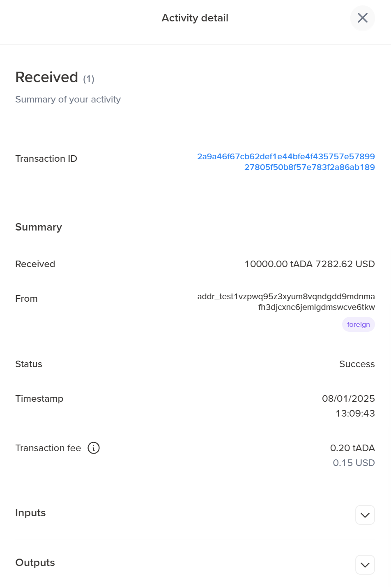

## 3.3 Sending test ada to another address 

Now that you have test ada, you can send it to another address. Lace allows for multiple accounts to be stored in a single wallet, each with a unique address. You can try sending some test ada from one address to another. 

By default, only account #0 is activated. To activate account #1, click the **Settings** button in the top right corner and select the **>** symbol in the panel that opens. A list of inactive accounts is displayed. Click **Enable** next to account #1. The wallet will prompt you to input your password. 

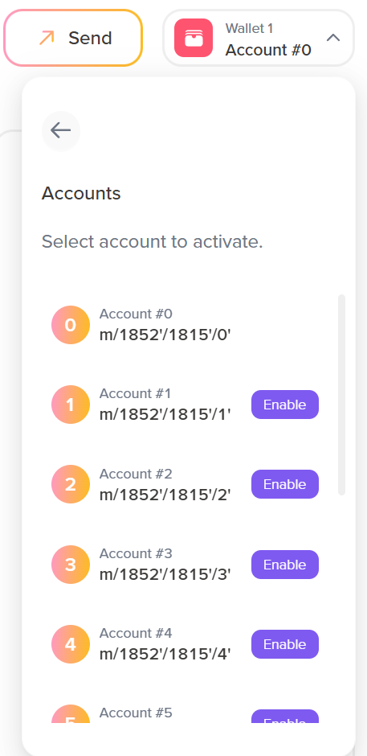

After that, your Lace homepage will display a new address with a balance of 0.00 USD. 

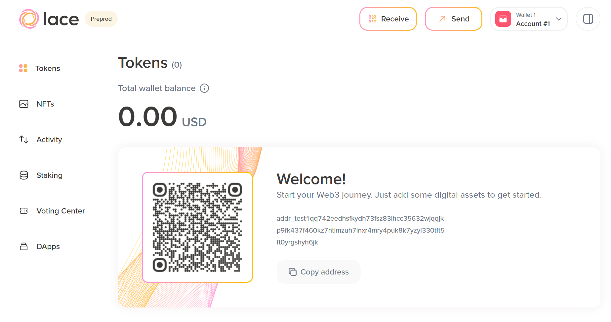

The new address is now:

```shell
addr_test1qq742eedhsfkydh73fsz83lhcc35632wjqqjkp9fk437f460kz7ntlmzuh7lnxr4mry4puk8k7yzyl330tft5ft0yrgshyh6jk
```

Copy that address and click the **Settings** button and the **>** sign. From the list of accounts, click  **account #0**. You will now see your previous balance of 10.000 test ada on the homepage. Click **Send** at the top. 

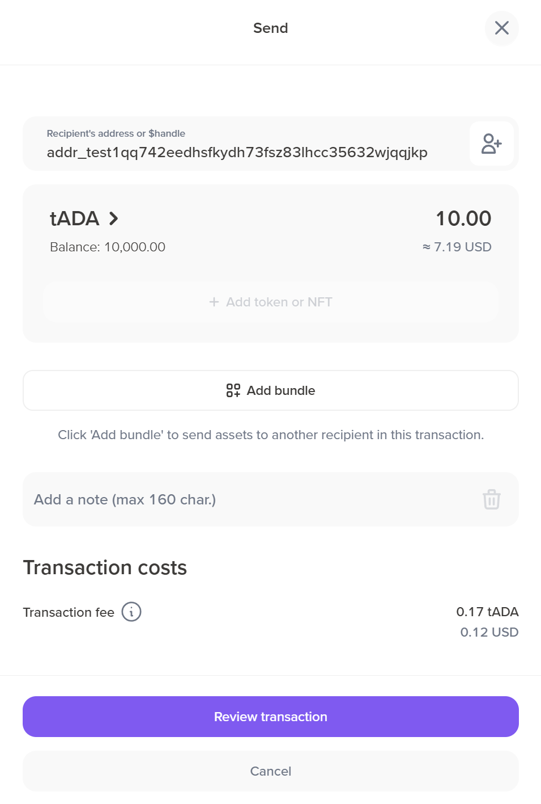

The send panel appears. Enter the copied address of account #1 and indicate the amount of ada to send to that address (eg, 10 test ada). There is also an option to add a note to the transaction, with a maximum of 160 characters. After entering the transaction details, click **Review transaction**. 

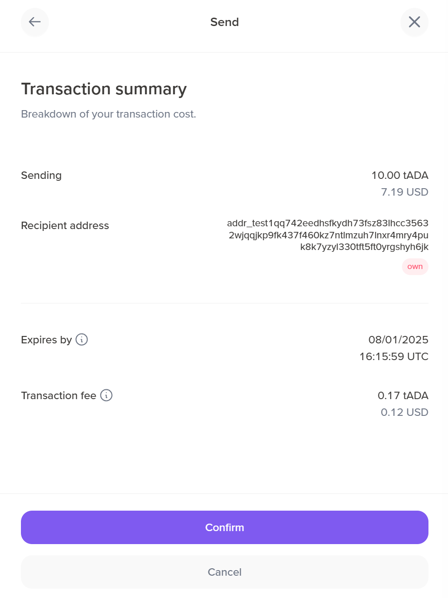

A transaction summary then appears. Review it and click **Confirm**. Enter your password when prompted and click **Confirm** again. After that, a confirmation message should appear, and you will be able to view the transaction. 

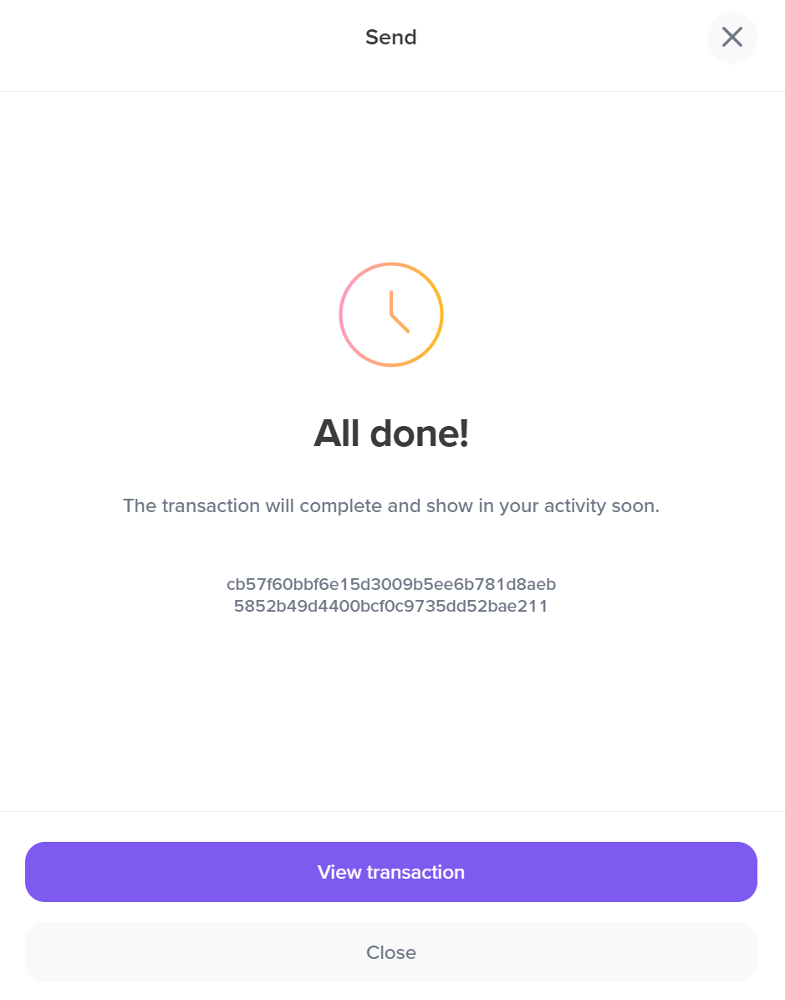

Clicking **View transaction** takes you to the **Activity** view, where you will see your transaction –  10.17 test ada sent. The 0.17 test ada is the transaction fee. 

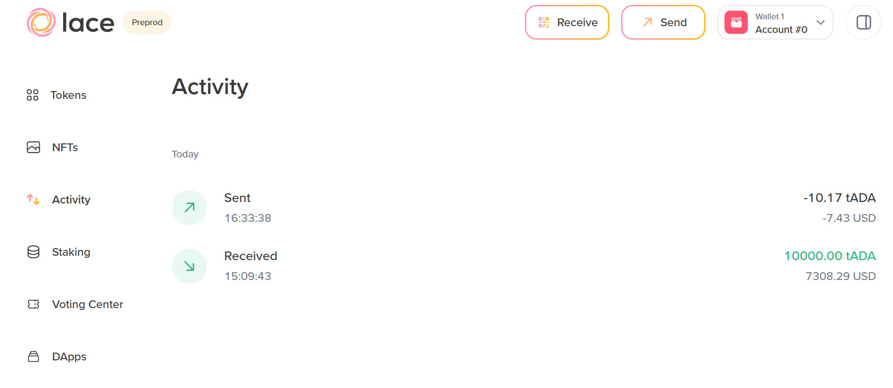

You can now switch to account #1 and see that you have received 10 test ada. A block time is 20 seconds in Cardano, and the wallet also needs some time to sync with the server that provides blockchain data for Lace. 

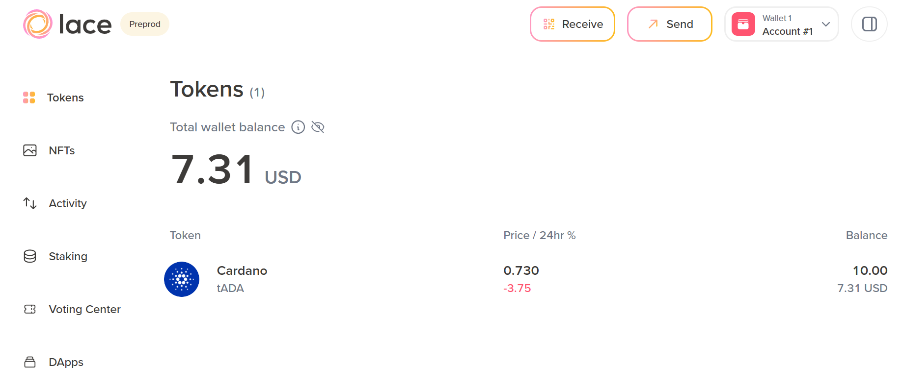

To view transaction details, click the transaction hash, which will open the [Cexplorer](https://cexplorer.io/) page. 

Note that even though we have sent test ada to an address that also resides in our wallet, the transaction was broadcast on the pre-production Cardano test network and was successfully processed by Cardano nodes running on this test network. 

## 3.4 Lace settings

Clicking the **Settings** button in the upper-right corner launches the settings panel. 

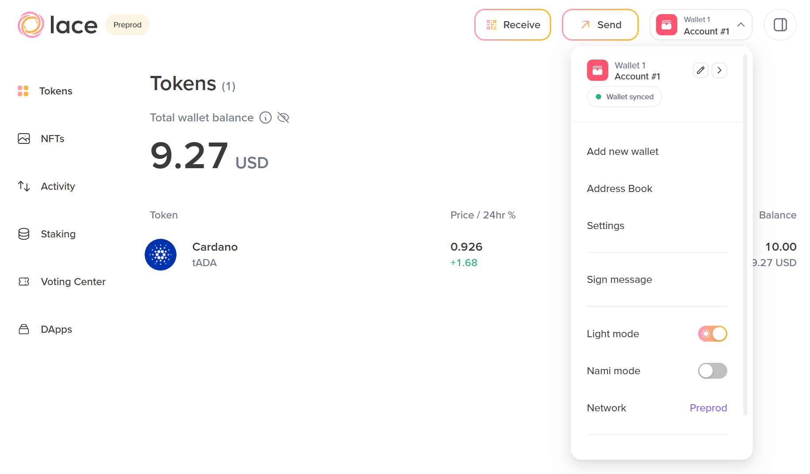

First, you will see the current account number and wallet name. As explained in the previous section, you can switch between multiple accounts in Lace, each with a unique address. If you click the pen button next to the arrow button at the top, a panel appears that allows you to modify the wallet and account names. 

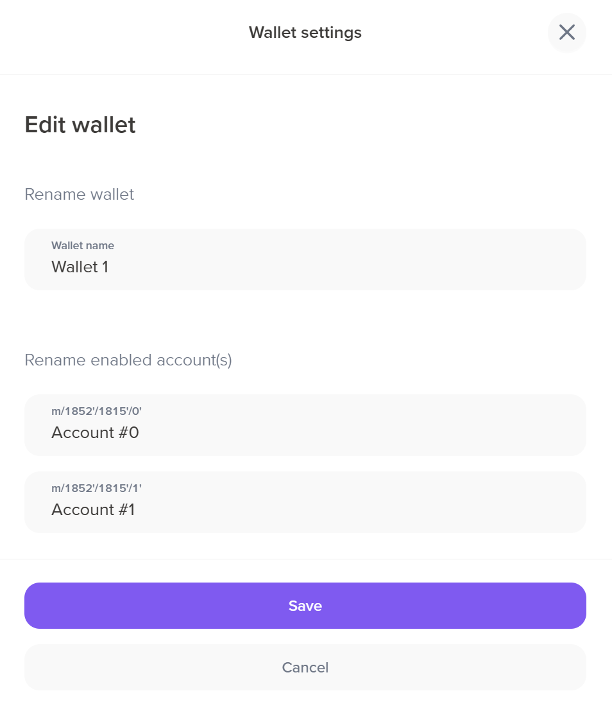

Below the wallet and account name, a status bar indicates whether or not the wallet is synced with the blockchain. Since the wallet needs to sync periodically, the status may occasionally display ‘*Not synced to the blockchain*’ or ‘*Wallet syncing*’. If these messages persist, you can also reopen the wallet to refresh the status. Once synced, the status will be ‘*Wallet synced*’. You can submit transactions no matter the status. Once the wallet is synced, the transaction will be broadcast to the network. 

Quick settings include such options as: 

* ***Add a new wallet***. You can add another wallet to Lace by creating a new wallet, importing an existing one, or connecting a hardware wallet.   
* ***Address book***. You can store and view saved addresses associated with a user-defined name.   
* ***Settings***. Opens up the full Lace settings window.   
* ***Sign message***. Allows to cryptographically sign a user-defined message to prove the authenticity of the message.   
* ***Light mode***. The toggle allows switching between light and dark mode.   
* ***Nami mode***. The toggle allows switching between the Lace wallet and the Nami wallet, which is now part of Lace.    
* ***Network***. Allows a user to switch the network to which Lace is connecting. 

Click **Settings** to view the full Lace settings, which are grouped into six categories: 

* ***Wallet***. Enables network selection, setting a local Cardano node and Cardano submit API, viewing authorized DApps, viewing public and staking keys, adding or removing collateral, and syncing a new address.   
* ***Preferences***. Enables setting a local currency, choosing a theme, testing the beta program, and enabling console logging.   
* ***Security***. Allows viewing the recovery phrase of the wallet and generating a paper wallet. For the paper wallet, a [PGP](https://en.wikipedia.org/wiki/Pretty_Good_Privacy) public key needs to be generated.   
* ***Support***. Provides links to the Lace FAQ page and the IO Zendesk page, where users can submit a support ticket for any issues they encounter.   
* ***Legal***. Allows viewing of the terms and conditions, privacy policy, and cookie policy documents.   
* ***Remove wallet***. Used to uninstall the wallet extension from the browser. The wallet can be restored at any time if the user has access to its recovery phrase. This action does not affect the wallet balance in any way. 

After viewing the wallet settings, you can return to the main window by clicking **Tokens** on the right side.
