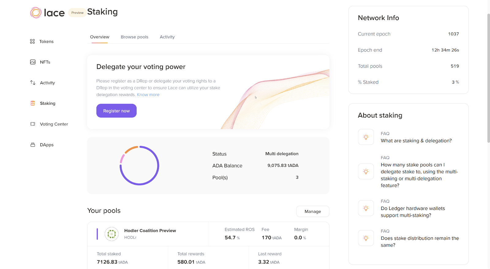
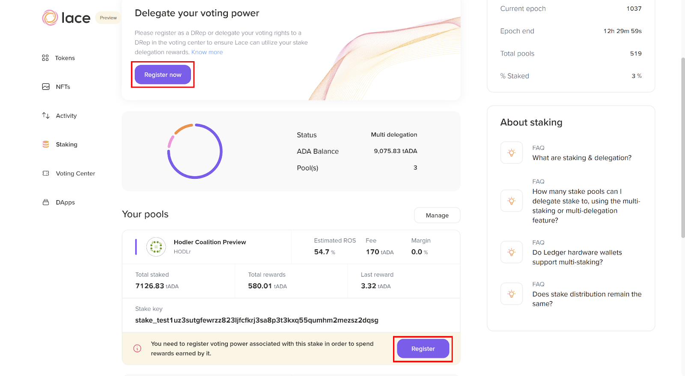
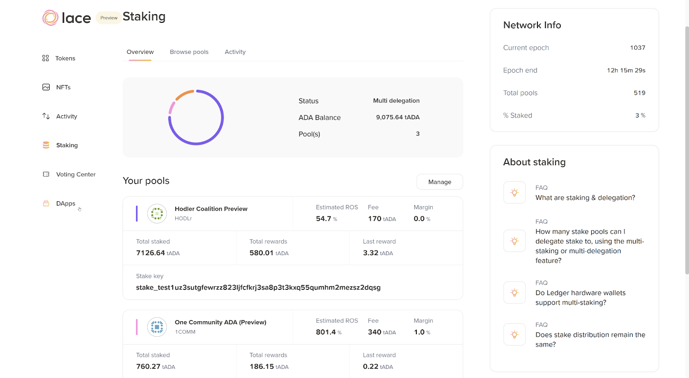
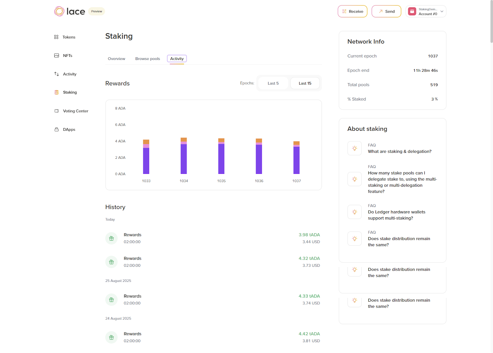

# 4.6 Retrieving staking rewards

In Cardano’s current design, where governance was integrated as described in [CIP-1694](https://www.1694.io/en), staking rewards are tied to governance participation. This means that simply delegating ada to a stake pool is no longer enough. To receive staking rewards, users *must* also make a governance choice, either:

* Delegate their voting power to a delegated representative (DRep), or  
* Register as a direct voter (or as a DRep yourself).

Why? Because Cardano governance is designed to ensure that everyone who benefits from the network by earning staking rewards also contributes to its future. Even if users don’t want to vote directly, they can still support governance by delegating to someone they trust.

At this point, the term ‘governance’ may sound strange, but don’t worry, you’ll learn more about the Cardano governance model in the next section. For now, you should be aware that participating in Cardano governance is necessary to receive staking rewards.

As explained in the previous section, after staking ada, users get a message to register their voting power. This process is described using a testing wallet that has staked ada across various pools.

The first step is to register your voting power. As shown in the image below, users can begin the process by clicking the ‘Register now’ button in the ‘Delegate your voting power’ box or in the ‘Register’ button visible below any pool description box.

After clicking either of these buttons, users can continue the voting power delegation process on a third-party platform. Consult the lesson *Participate in Cardano governance with Lace* to learn how to delegate voting power and how to become a DRep or a direct voter.

Once users register their voting power, the messages encouraging participation in governance are no longer visible.

Users don’t need to create a separate transaction to withdraw staking rewards when using Lace, since they are automatically included in the total wallet balance, which represents the full staked amount. Whenever users send ada, Lace uses all available rewards if needed, which helps lower transaction fees and makes the process seamless.

Staking rewards are automatically distributed to the rewards address at the end of each delegation cycle. A cycle consists of four epochs, with each epoch lasting five days. This means it usually takes 16-20 days for rewards to appear in Lace. After that, rewards are added at the end of every epoch, for as long as the delegation remains in effect.

If you already delegated using a single-address wallet and then restored it in Lace, delegation continues without any extra steps. And remember: your ada never leaves the wallet throughout delegation, it stays fully accessible, and it is not locked.

## 4.6.1 Tracking your staking rewards in Lace

Once ada is staked, it’s important to keep an eye on the earned rewards. Lace makes this simple by providing a clear overview of the staking activity.

To get started, open Lace, go to the ‘Staking’ tab, and click ‘Activity.’ This section provides a detailed history of the staking rewards earned, showing each previous payout and when the next one is due.

One of the advantages of Cardano’s staking model is its flexibility. Users can switch to another stake pool at any time without penalties. The rewards history will remain visible, and ada will always stay safely in the wallet.

Lace simplifies tracking progress, helps anticipate the next payout, and allows managing the staking strategy with confidence.

Congratulations on finishing the staking lesson! Staking is the foundation of participation in the Cardano ecosystem. By delegating ada to a stake pool, you help secure the network and earn rewards. However, Cardano takes it one step further: it connects staking with governance. To continue receiving rewards, users must also decide how to utilize their voting power, either by delegating it to a DRep or by voting directly. In this way, staking and governance work hand in hand, ensuring that everyone who benefits from the network also has a voice in shaping its future. You can now proceed to the next lesson, where you will learn how to participate in Cardano governance using Lace.
