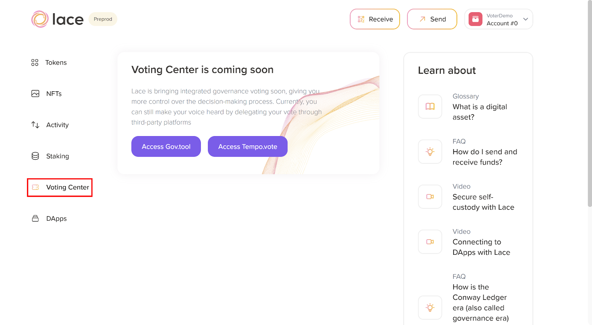
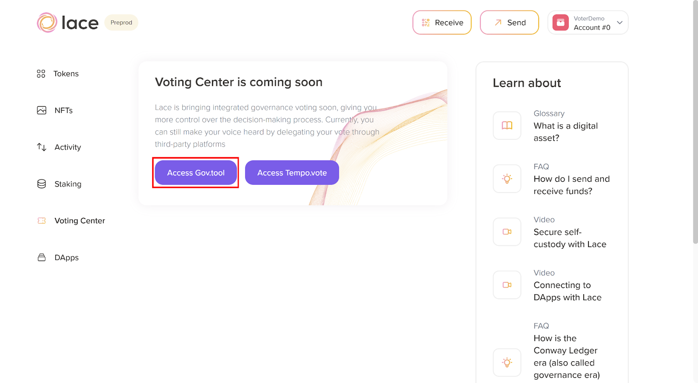
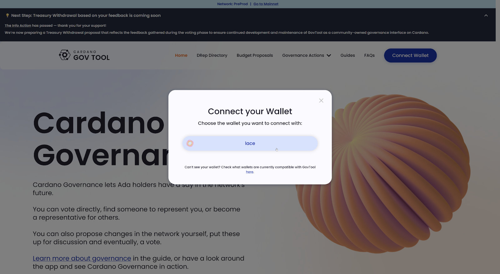
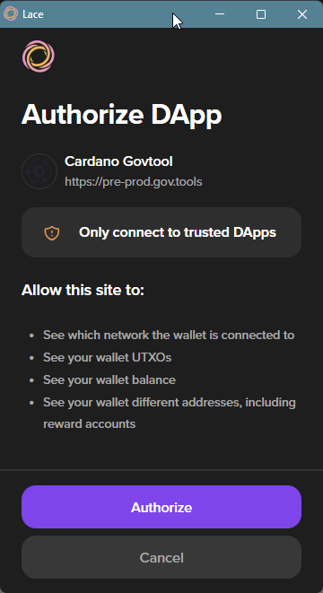
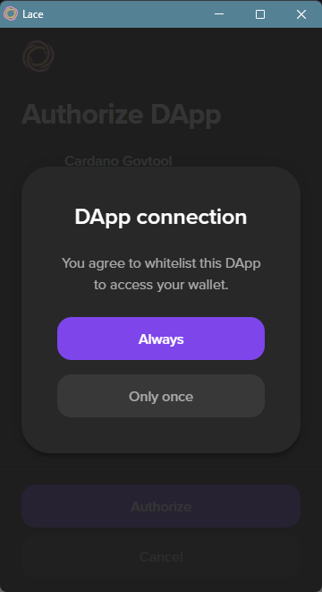
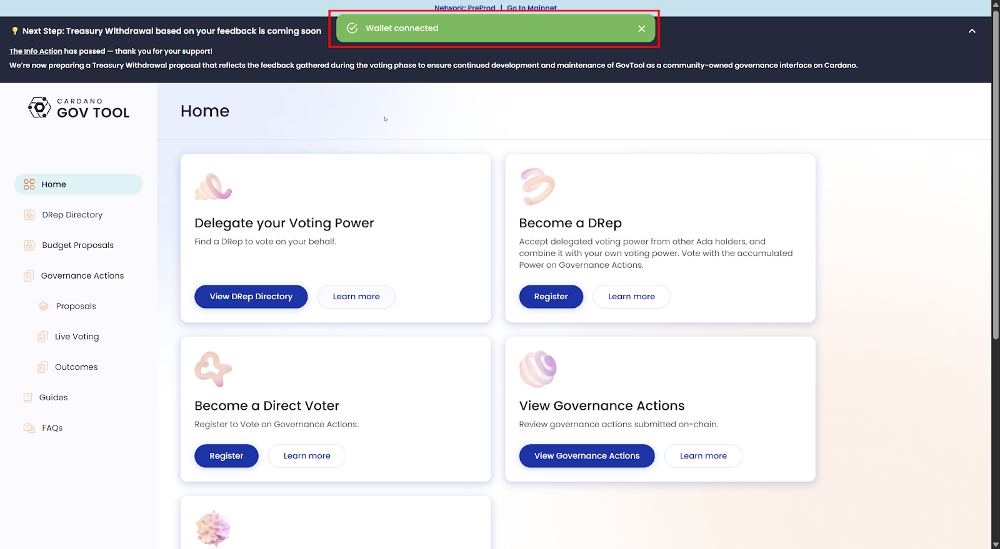

# 5.2 Connecting Lace with the Cardano governance tool

You can use any wallet to participate in Cardano governance, but since this course is focused on Lace, you’ll learn how to connect Lace to a governance platform.

At the time of publication, Lace does not yet have built-in governance features. Users need to connect their wallets to a third-party platform such as Gov.tool or Tempo.vote. For this demo, we will use the Gov.tool platform, also known as Cardano governance tool or GovTool.

First, open  Lace and ensure it’s connected to the correct account. From the main dashboard, look for the **‘Voting Center’** section, as shown in the following image.

Click the ‘Access Gov.tool’ button to continue.

Next, the Cardano governance tool portal will launch. On the main page, click the ‘Connect Wallet’ button to continue. As shown in the image below, a window will appear to confirm the wallet you wish to use.

To move forward, you need to authorize the wallet to connect to the DApp, as you can see in the image below.  

After clicking  ‘Authorize’, you can choose either ‘Always’ or ‘Only once.’ We’ll select ‘Only once’ for this demo.

After a successful connection, you’ll see a confirmation message as shown in the following image.

Congratulations! You successfully connected your wallet to GovTool. Now, you can use Lace to participate in Cardano governance. In the next section, you will learn how to delegate your voting power to a DRep.
