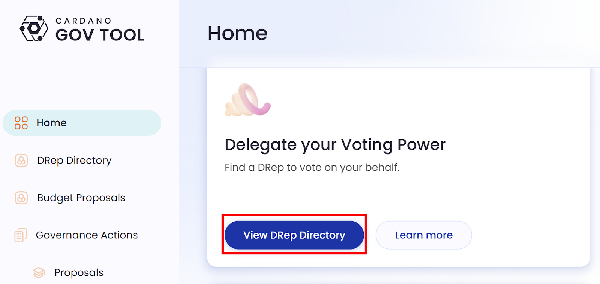
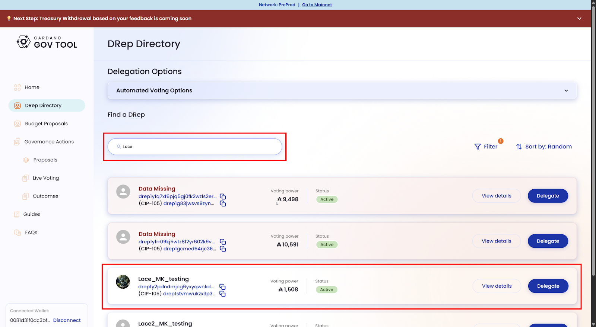
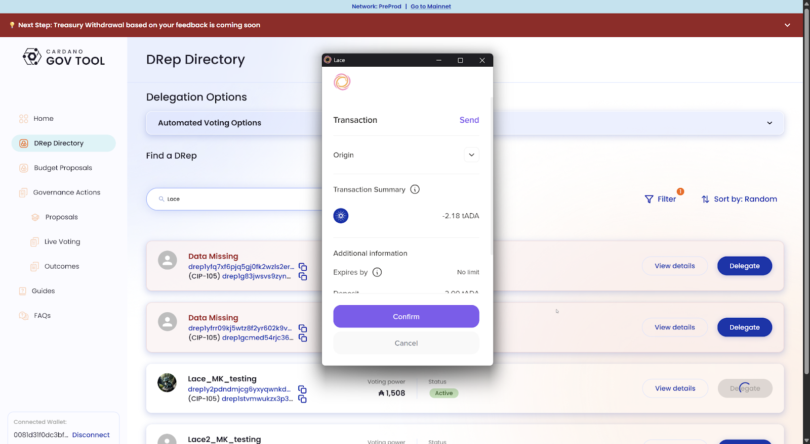
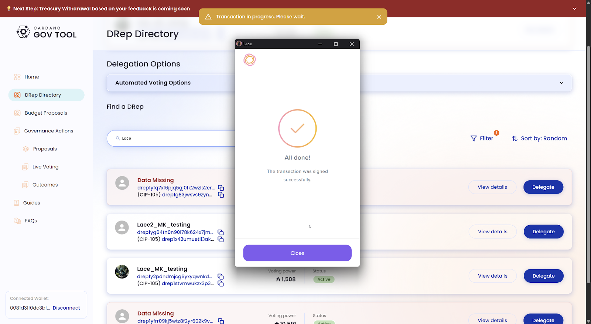
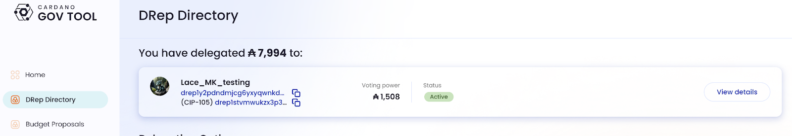
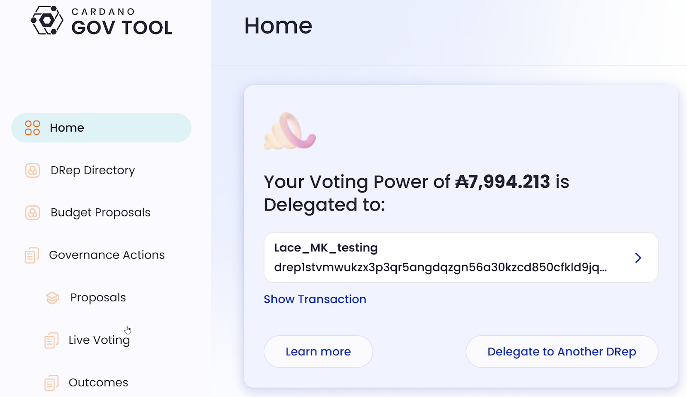

# 5.3 Delegating your voting power to a DRep

*Disclaimer: please be advised that the accompanying screenshots are only intended to illustrate the process of delegating voting power to a test DRep within the pre-production network. This is no explicit endorsement for any specific DRep. You retain the autonomy to delegate your voting power to any DRep that aligns with your preferences.*

Delegating your voting power in Cardano governance is like choosing a trusted representative to speak on your behalf. With the Lace wallet, this process is straightforward and only takes a few minutes. Just follow the next steps after a successful connection to the GovTool.

From the main screen, choose ‘View DRep Directory’ in the ‘Delegate your Voting Power’ section.

Next, GovTool will display a list of available DReps. Each DRep may provide information about their mission, values, and how they plan to represent the community. Take your time to review these profiles. Delegating is about choosing someone you trust to vote with your interests in mind. For this demonstration, we’ll select a test DRep called ‘Lace\_MK\_Test’ that you can find by typing ‘Lace’ in the search box.

Once you’ve decided, select your preferred DRep and click ‘Delegate.’ GovTool will create a transaction, and Lace will pop up asking you to approve it. This is the step where the delegation is officially recorded on the blockchain.

After approving, your voting power is successfully delegated!

From now on, your chosen DRep will vote on proposals on your behalf. If you change your mind, you can always return to GovTool and delegate to a different DRep, or withdraw your delegation and vote independently.

You can see which DRep has your delegation in the DRep directory or the GovTool home, as shown in the following images.

View from the DRep directory:

View from the GovTool home page:

GovTool is the interface that helps you navigate governance, while Lace is the wallet that securely signs and records your delegation on-chain. Together, they make participation in Cardano governance both easy and secure. Read [GovTool’s documentation](https://docs.gov.tools/cardano-govtool/using-govtool) to learn more.
