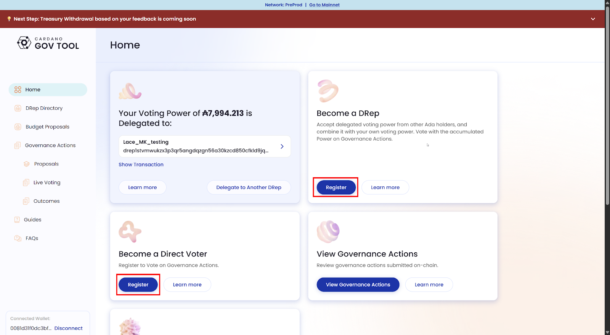
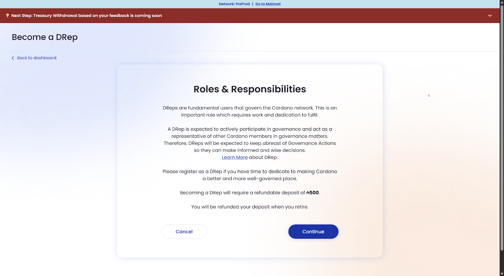
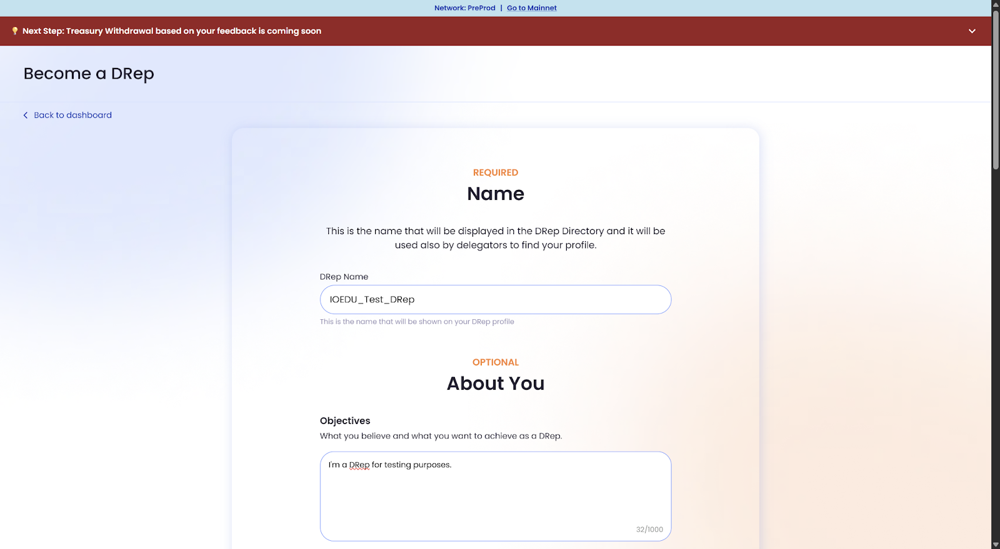
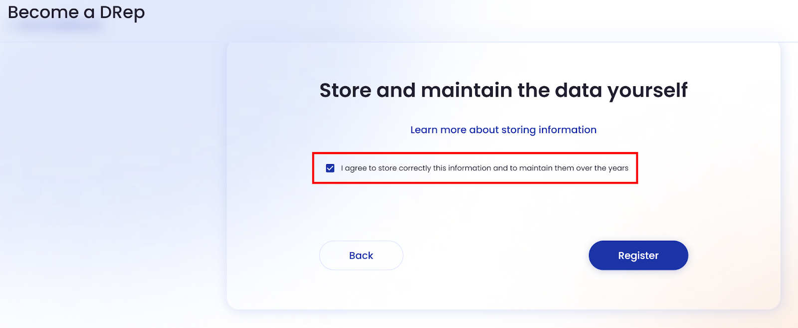
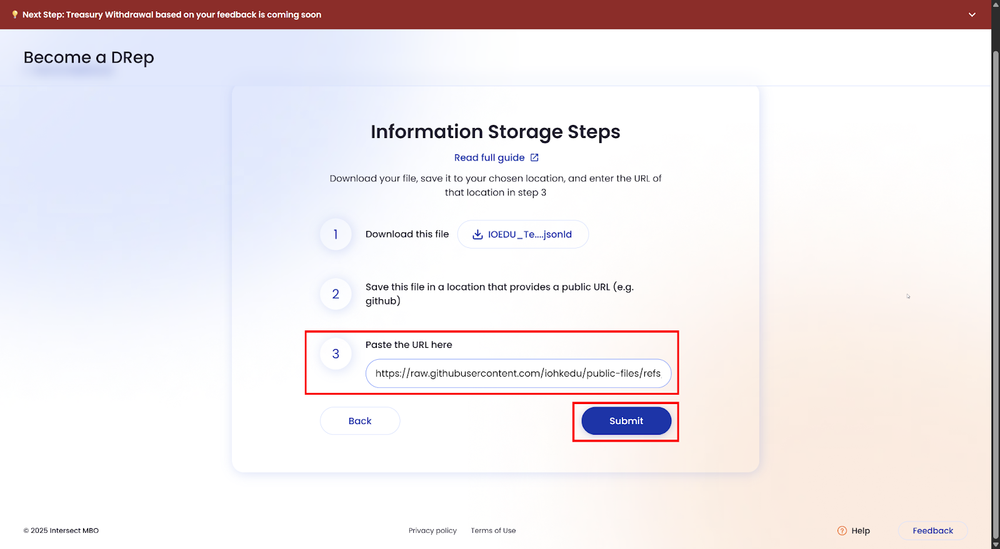
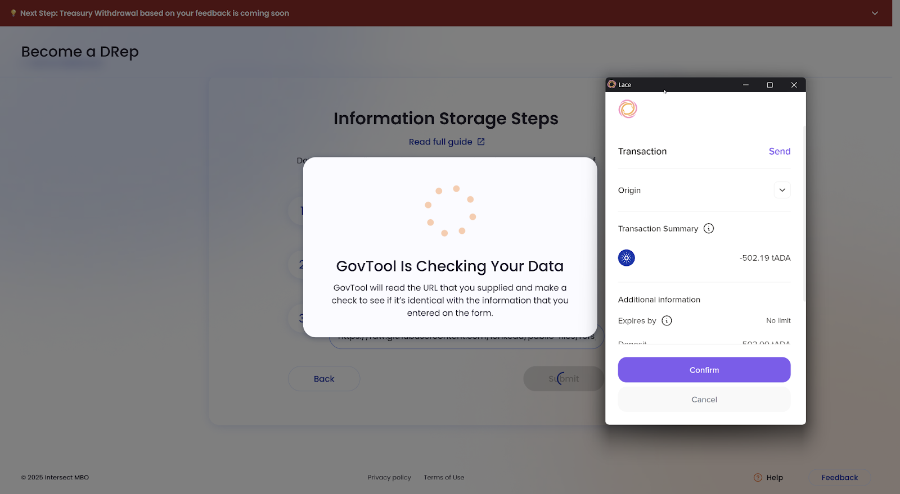
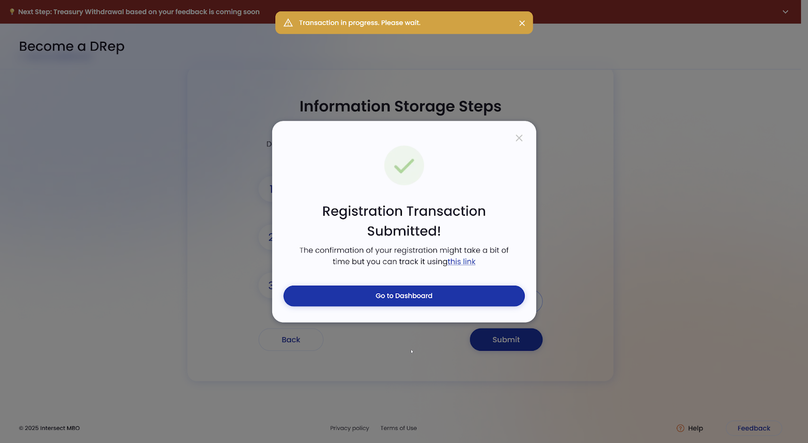

# 5.4 Becoming a DRep or independent voter

Just as you can delegate your voting power, you can also choose to take a more active role in Cardano governance by becoming either a DRep or a direct voter. Both roles give you direct influence over proposals, but with a slight difference. As a DRep, other ada holders can delegate their voting power to *you.* As a direct voter, you only vote in *your own name with your* *own ada*.

To register for either role, your Lace wallet must have at least 500 ada for a refundable deposit and a small, non-refundable transaction fee (currently under 0.2 ada). The registration process is straightforward, using GovTool and your Lace wallet to securely sign transactions and confirm participation on the Cardano network as follows:

1. Open GovTool and connect your wallet. Choose Lace from the list of supported wallets and approve the connection. If you have questions about this process, review [section 5.2](05-02-lace-and-govtool.md).

2. Next, from the GovTool options on the home page, click the ‘Register’ button on  ‘Become a DRep’ or ‘Become a Direct Voter’ as shown in the image below. In this example, we will follow the process to become a DRep.  
   

After clicking on the ‘Register’ button, you will see a message explaining the role and responsibilities. Read carefully, and if you agree, click  ‘Continue’.

If you are registering as a direct voter, you will be asked to sign the transaction, and you will be done. Becoming a DRep requires creating a voting identity, however. As you can see in the image below, choosing a DRep name is mandatory, while adding a short profile or mission statement to help others understand your motivation for becoming a DRep is optional. If you are really interested in becoming a DRep, provide as much information as possible.

After filling out the details, click ‘Continue’ to resume the registration process. DRep voting identity data is not stored on-chain. Every DRep must responsibly store their information off-chain and pass that link back to GovTool. As the following image shows, you must check the box and agree to this to proceed with registration.

After clicking ‘Register’, you need to download the JSON voting identity file created by GovTool and share it on a public location like a web server, GitHub, or Interplanetary File System (IPFS). While instructions for storing this file are beyond the scope of this course, you can follow [these instructions](https://docs.github.com/en/repositories/working-with-files/managing-files/adding-a-file-to-a-repository) to share the file. Learn more about [sharing information](https://docs.gov.tools/cardano-govtool/using-govtool/storing-information-offline).

After publishing the JSON file, paste the URL in the corresponding field and click ‘Submit’.

Once you click ‘Submit’, GovTool will verify your data and generate a registration transaction if it is correct. At this point, Lace will prompt you to review and approve a transaction for 500 ada \+ fees. This step records your role as a DRep directly on the blockchain.

The new role becomes active once the transaction is confirmed.

Review the following table, highlighting the key differences between a DRep and a direct voter so you can choose the role that best fits your level of participation.

| DRep | Direct voter |
| ----- | ----- |
| Represents **their own ada** *plus* any voting power delegated by other ada holders. | Represents **only their own ada**. |
| Can publish a **profile or mission statement** so others understand their values and vision. | No public profile is needed – voting is entirely personal. |
| Holds **greater influence** in governance if many ada holders delegate to them. | Holds **influence equal only** to their ada balance. |
| Takes on the responsibility of **studying proposals carefully** to vote on behalf of the community. | Votes only for themselves, with **no responsibility toward others**. |
| Ideal for community leaders, educators, or experts who want to actively shape Cardano’s future. | Ideal for ada holders who want to **vote directly** without delegating to anyone. |

Whether you choose to become a **DRep** or a **direct voter**, you are actively shaping the future of Cardano by making your voice count in governance. Congratulations on finishing this section! In the next section, you will learn how to vote on governance actions.
