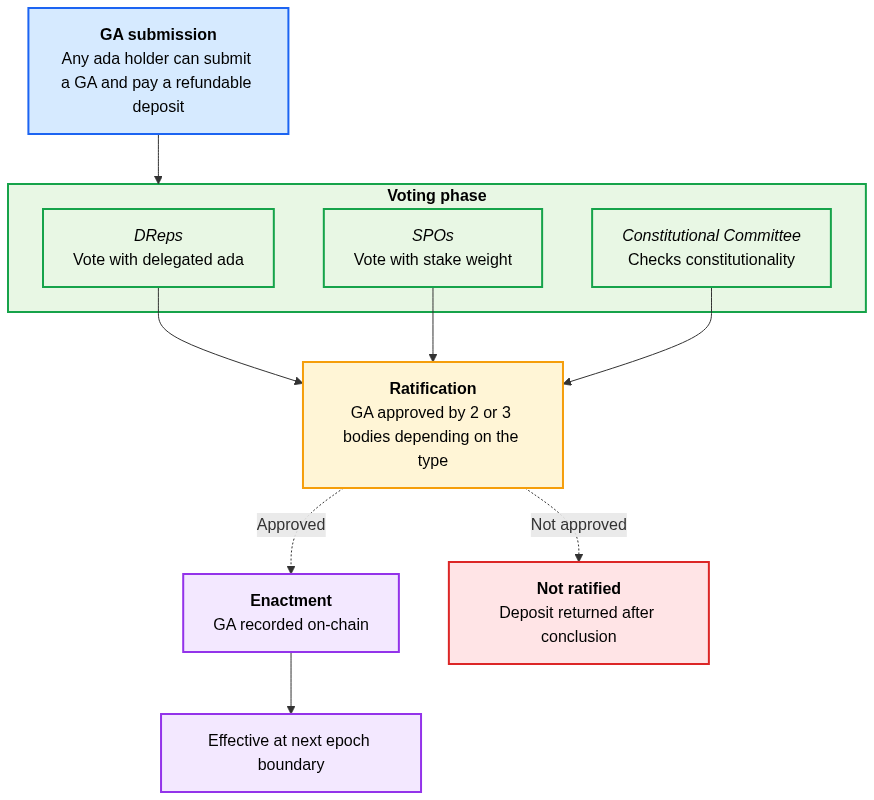
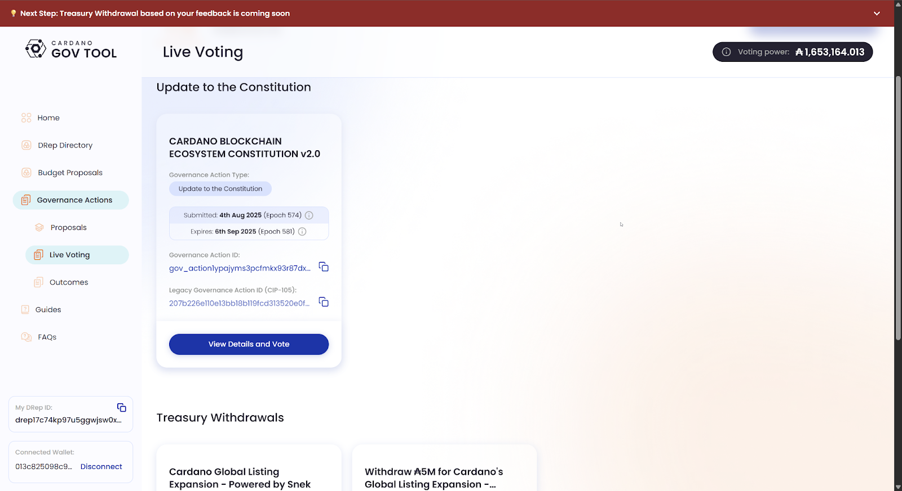
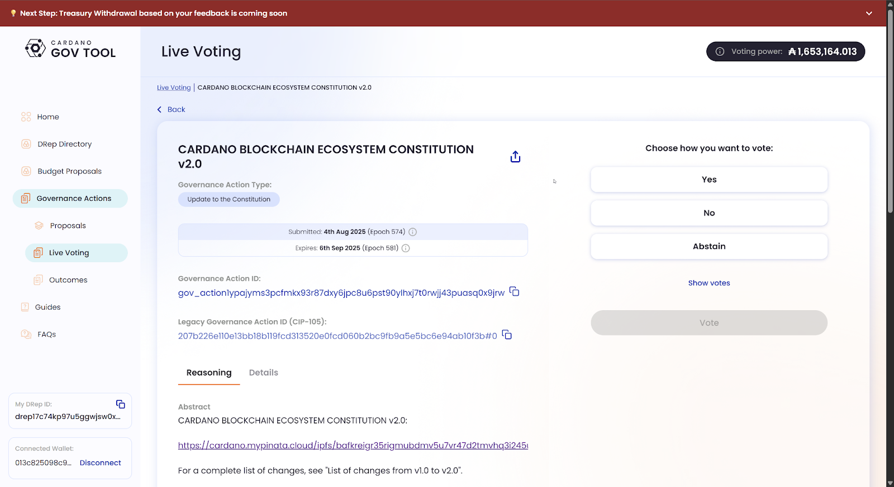
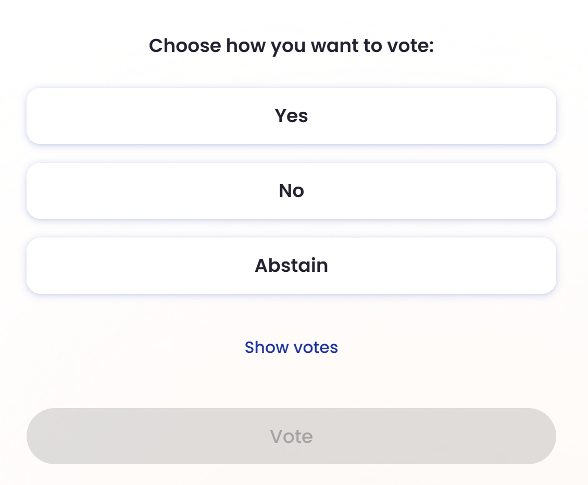
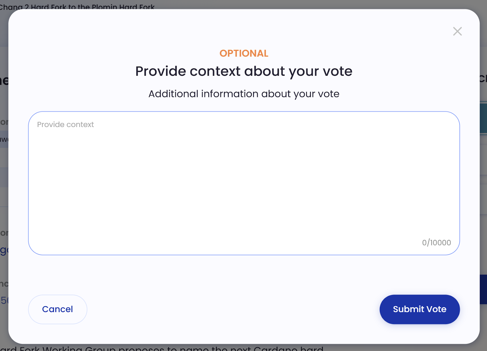
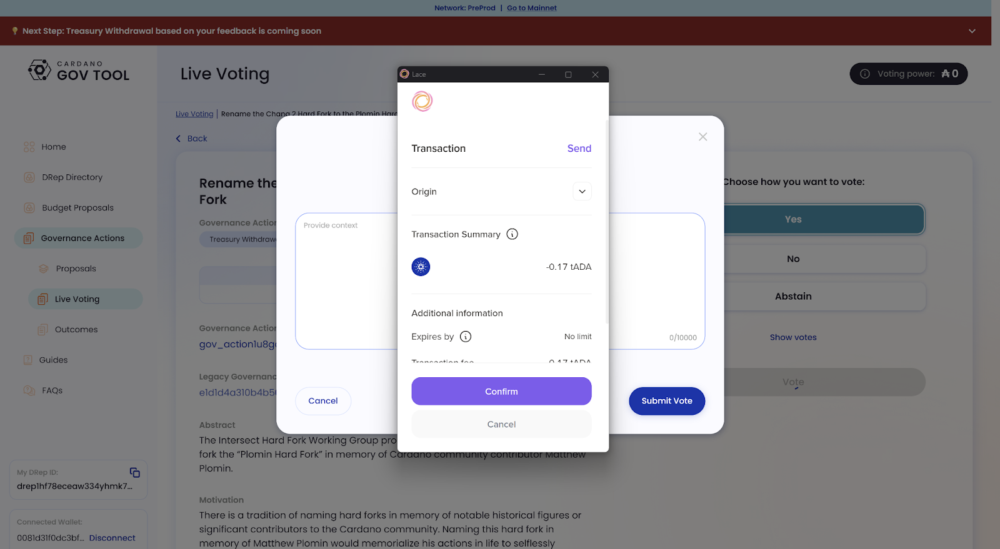

# 5.5 Voting on governance actions

In this section, you’ll learn about governance actions and how to use Lace and GovTool to vote on them.

## 5.5.1 Understanding governance actions

In the Cardano ecosystem, governance is facilitated through governance actions (GAs), as defined by [CIP-1694](https://www.1694.io/). GAs are the formal proposals that ada holders and representatives can vote on. Each action type serves a different purpose, from adjusting technical parameters to funding community projects. Understanding these categories is key to participating effectively in governance.

Here’s a brief description of the core types of GAs.

1. **Motion of no‑confidence:** a proposal to remove the current CC, expressing that the committee is no longer trusted to perform its duties. This GA creates a **state of no-confidence**.  
2. **Update committee and/or threshold and/or terms:** proposals to change the membership, decision‑making threshold, or term lengths of the CC.  
3. **New constitution or guardrails script:** modifications to the constitution or the policy governing how proposals are created and processed (recorded via on‑chain hash).  
4. **Hard fork initiation:** a planned, backwards-incompatible upgrade of the protocol that transitions the network to a new major version.   
5. **Protocol parameter changes:** updates to adjustable network parameters like transaction fees or staking limits, excluding hard fork triggers.  
6. **Treasury withdrawal:** requests to draw funds from the Cardano treasury to support community projects or initiatives.  
7. **Info action:** an on‑chain record used to share information or conduct polls. It has no direct effect on the network itself.

After reviewing the different types of governance actions, the next step is to understand how they actually move through the system. Submitting, voting, and enacting a GA follows a structured process that ensures fairness, transparency, and decentralization. Let’s see how it works in practice.

1. **Submission:** any ada holder can submit a GA by paying a refundable deposit.  
2. **Voting:** the three governance bodies (DReps, SPOs, and CC) review the proposal and cast their votes.

3. **Ratification:** on-chain voting ratifies GAs. Most actions require two of the three governance bodies for ratification, except for hard fork initiations and security-relevant protocol parameters, which demand all three.  
4. **Enactment:** once ratified, the action is recorded on-chain and takes effect at the next epoch boundary. If a GA is not ratified, the deposit \-minus the fees- is refunded .

The following image shows a visualization of this process. Visit the [CIP-1694 site](https://www.1694.io/) to learn more about GAs.

Understanding the process of how GAs work is only half the journey. To truly participate, as an ada holder, you need to exercise your voting power. As you learned before, this can be done either directly or by delegating to a DRep, and the Lace wallet makes this process simple. Let’s now explore how to use Lace to cast your vote, whether you’re choosing to act as a direct voter or empowering a DRep to vote on your behalf.

## 5.5.2 Voting on a GA with GovTool and Lace

Once a GA is submitted, it becomes available for voting. If you are registered as a direct voter or DRep, here’s how you cast your vote using GovTool and Lace.

1. **Open GovTool and connect your wallet.** Choose Lace from the list of supported wallets and approve the connection. If you have questions about this process, review [section 5.2](05-02-lace-and-govtool.md).  
2. **Select a GA.** On the GovTool navigation menu, click  ‘Governance Actions’ to browse the list of active GAs. Each action will have details explaining its purpose. Select the one you wish to review by clicking ‘View Details and Vote’.  
     
3. **Review the proposal.** Read the full description *before* voting. Pay attention to the rationale and any supporting documents, since your decision will directly impact the future of Cardano.  
     
4. **Choose your vote.** You’ll typically see three options: **Yes**, **No**, or **Abstain**. Select the option that reflects your decision and click  ‘Vote’.  
   
5. **Provide a rationale for your vote.** After clicking  ‘Vote’, a window will pop up to provide optional context about your vote. Click  ‘Submit Vote’ to continue.  
     
6. **Confirm the vote in Lace.** After submitting your vote, GovTool will request that Lace sign the transaction. Approve it in your wallet to record your vote on-chain.  
     
7. **Vote recorded.** Once confirmed, your vote is officially on-chain. You can return to GovTool to check the status of the GA at any time and see how the community is voting.

This section clarifies that GovTool serves as the platform for reviewing and interacting with proposals, while Lace functions as the secure wallet responsible for signing and registering decisions on-chain. Collectively, these tools facilitate universal access to voting within the Cardano community.

Congratulations on finishing the governance section! Now you know how to participate in Cardano governance with the help of Lace.
