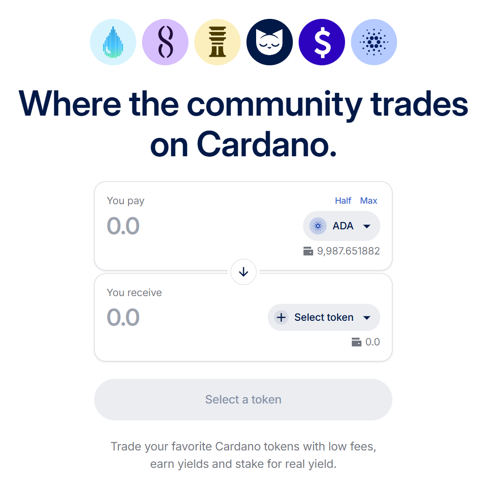
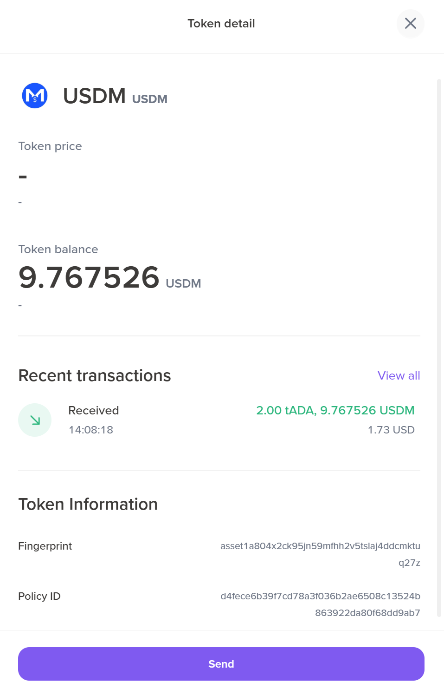

# 6.4 Buying and selling tokens on a DEX

A decentralized exchange (DEX) is an online marketplace where tokens are exchanged for ada or other Cardano native tokens. In a DEX, smart contracts handle the token exchange, meaning no central entity controls the assets on the exchange. Other blockchains that offer [Turing-complete](https://www.essentialcardano.io/glossary/turing-completeness) smart contract capabilities may also be used to build a DEX.

This section explains how to purchase the USD-backed USDM stablecoin using [Minswap DEX](https://testnet-preprod.minswap.org/), as it offers trading functionality on the pre-production network, which is ideal for educational purposes. When deciding which DEX to use for trading on the mainnet, users can consult the [CardanoCube](https://www.cardanocube.com/cardano-ecosystem-interactive-map) interactive map, which categorizes projects building on Cardano under various categories, including exchanges and NFT and token minting. The [Cardano developers](https://developers.cardano.org/showcase/) showcase page offers similar functionality.

1. Click  ‘Connect wallet’ on Minswap and select Lace from the list.

    

2. Authorize the DApp to access the wallet’s information on the ‘Authorize DApp’ window.

    

3. Click  ‘Authorize’ and then choose whether to grant access to the DApp always or only once.

    

4. After connecting the wallet, the shortened address becomes visible in the top right corner.

    

5. The wallet can now use the DEX to trade ada. Click the ‘Select token’ drop-down menu.

    

6. The token selection window appears. Toggle off the ‘Verified tokens only’ option to get a larger variety of tokens.

    

7. Select the [USDM](https://nbx.com/en/usdm) fiat-backed stablecoin and enter the amount of ada to swap and the corresponding USDM amount.

    

8. At the current ada price, 10 ada would be the equivalent of 9.76 USDM tokens. Click  ‘Trade now*’*.

    

9. Click ‘Confirm’ and enter your wallet password to confirm the transaction.

    

10. After confirming the transaction, Minswap displays a confirmation window. Users might also hear a cat purring sound, since Minswap’s logo is a cat.

    

11. The USDM tokens are now visible.

    

12. Click USDM tokens to view transaction and token details.

    

The tokens can now be traded back for ada or any other token. Purchasing USDM tokens on mainnet means they can be used in another DApp or at a store to pay for a product or service. Click the wallet address in the top right corner to disconnect from the exchange after completing the trade if desired. After that, the Minswap wallet appears, displaying the token balance.  

Click the power button to disconnect the wallet.

Besides fiat-backed stablecoins, there are also algorithmic-backed stablecoins, where algorithms ensure the stability of the stablecoin. DJED is an overcollateralized stablecoin that uses ada as collateral to ensure stability. The protocol is backed by 400-800% overcollateralization and is guaranteed by its reserve coin, SHEN. The protocol eliminates the need for trust in a governance token, as seen in algorithmic stablecoins. The [DJED platform](https://www.djed.xyz/) is also fully decentralized and community-driven, allowing for open-source development and community involvement in minting and burning DJED and SHEN.
