# 7.2 How to get a handle

An ada handle is a one-time purchase only. If you send the associated NFT to another address, the handle name resolves to that new address. This makes handles reusable and allows you to buy handles directly from other users. To check if a handle is available for minting, type in the name of the handle in the search bar on the [ada handle](https://handle.me/) page.

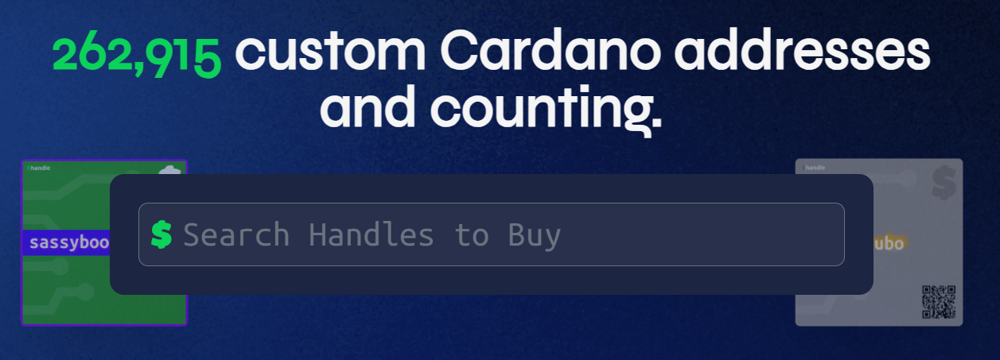

Another option is to append the handle name to the URL of the page as:

```shell
https://handle.me/<handle_name> 
```

If the handle exists, its associated address is displayed. If it does not exist, a message appears stating that the handle has not been minted and is available for purchase. Five tiers of rarity define a handle’s price. The project uses a fair value model called *stable pricing*. It is an algorithm-based pricing model that protects users from market volatility and dynamically adjusts as the value of ada rises or falls.

At the time of writing, and the price of ada $0.819, the prices for handles are:

* Legendary (1 character): auction only  
* Ultra rare (2 characters): 570 ₳
* Rare (3 characters): 260 ₳
* Common (4–7): 70 ₳
* Basic (8–15): 15 ₳.  

The current prices of handles available for minting are listed on the [FAQ page](https://handle.me/#faq) under *How much does a Handle cost*. Prices for handles resold by users may vary.

To mint a handle on the pre-production network, go to [https://preprod.handle.me/](https://preprod.handle.me/). First, connect your wallet by clicking **Connect Wallet** in the upper-right corner.


The *Choose your wallet* window appears. Select Lace and confirm that you have read and agreed to the ada handles [terms of use](https://preprod.handle.me/#tou).

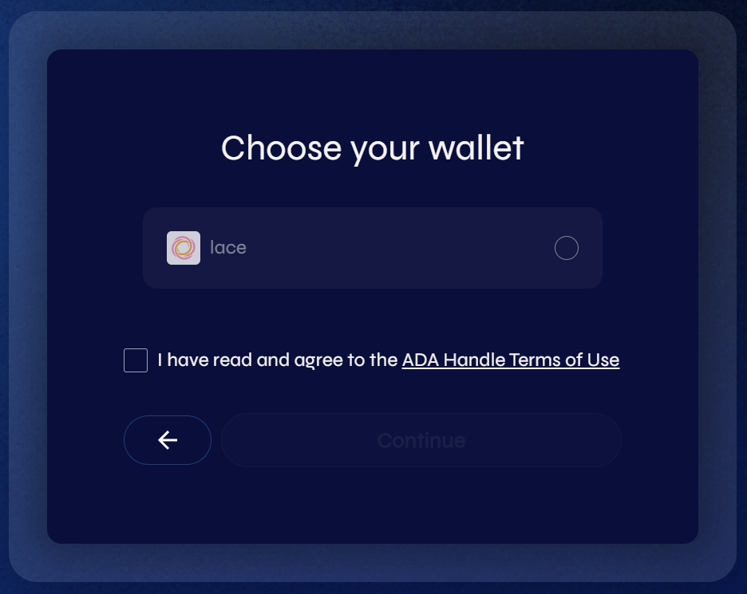

Once you have selected Lace and confirmed having read the terms of use, the **Continue** button appears. Click it. Next, the window for DApp authorization appears.

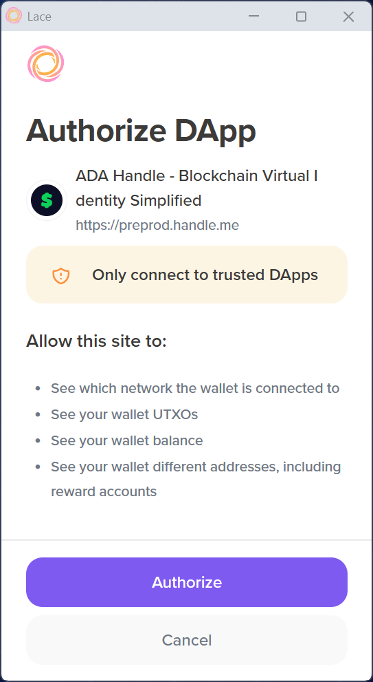

Click **Authorize** and allow access. You can decide whether to allow this DApp permanent access to your wallet information or only once. Selecting one-time authorization means the DApp will request approval each time you connect.

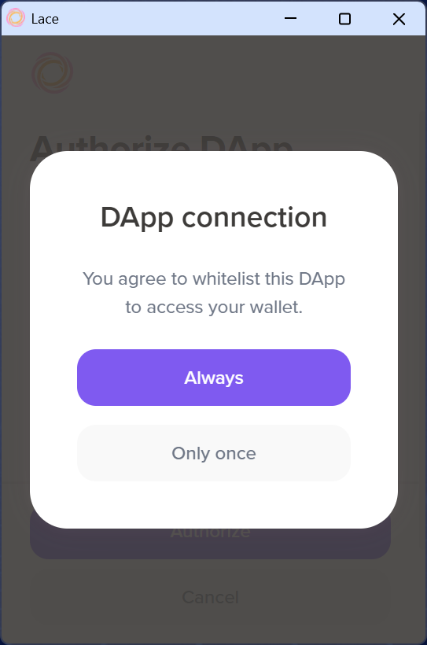

After connecting Lace, a $Get Handle option appears in the upper-right corner of the page, along with a wallet icon next to it.


For this lesson, the handle name lace\_course will be used. You can pick your own handle name. Enter it into the handles search bar. The mint information window appears.

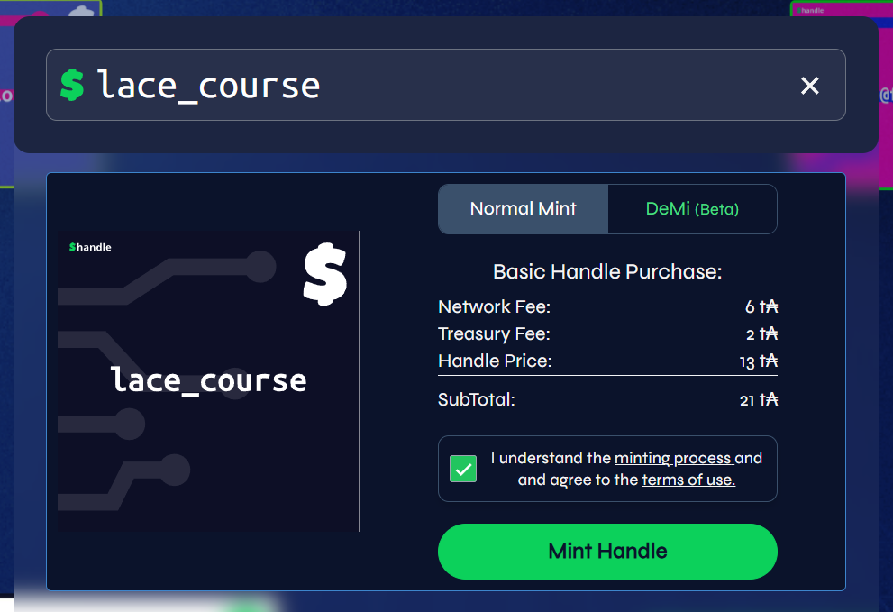

The minting fee is displayed along with two tabs – *Normal Mint* and *DeMi (beta)*. *Normal Mint* uses a policy controlled by the ada handle team. This requires transactions to be signed with a team-controlled key, which adds some centralization to the minting process. *DeMi* (decentralized minting), offers a more decentralized approach, but it is experimental at the time of writing and may have limited functionality.

For this lesson, *Normal Mint* is used. Confirm that you agree to the terms of use and click **Mint Handle**. The Lace transaction confirmation window appears.

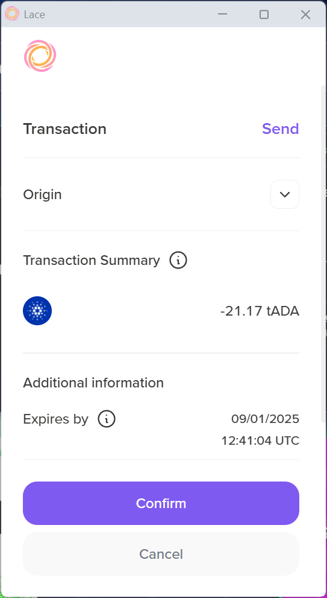

Click **Confirm** and enter your Lace password to confirm the transaction.

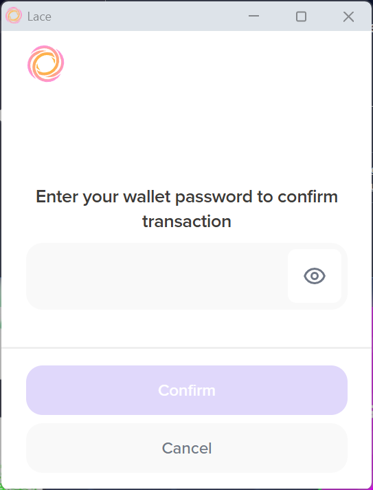

After the transaction is confirmed, a message appears:

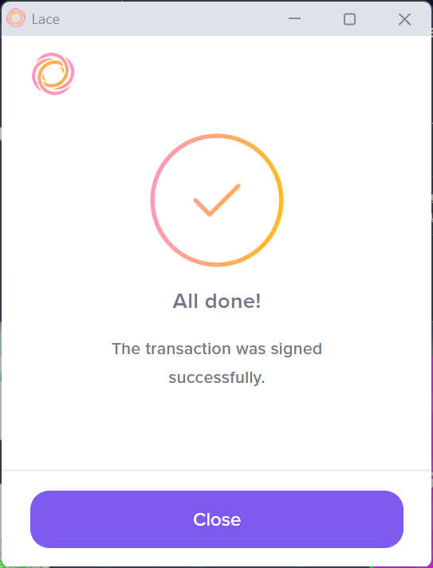

The ada handles page will first display a message that the transaction is being submitted.

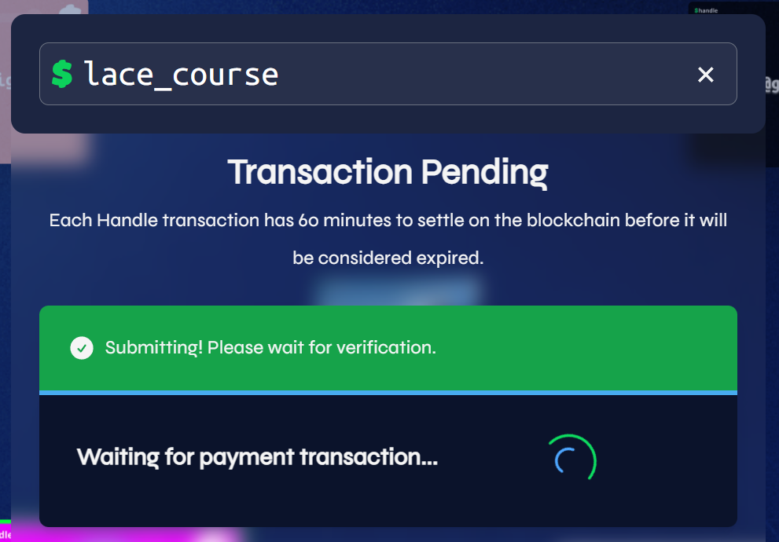

Then, it will display a confirmation message stating that the DApp is waiting for the handle to appear in the wallet.

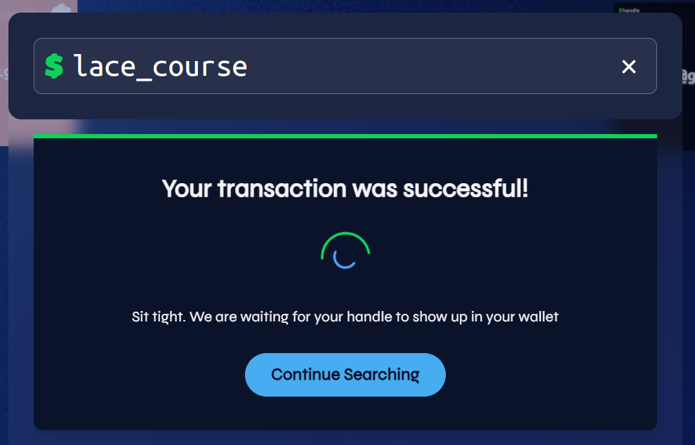

Once the handle NFT is  in your wallet, it is also displayed on the handle page.

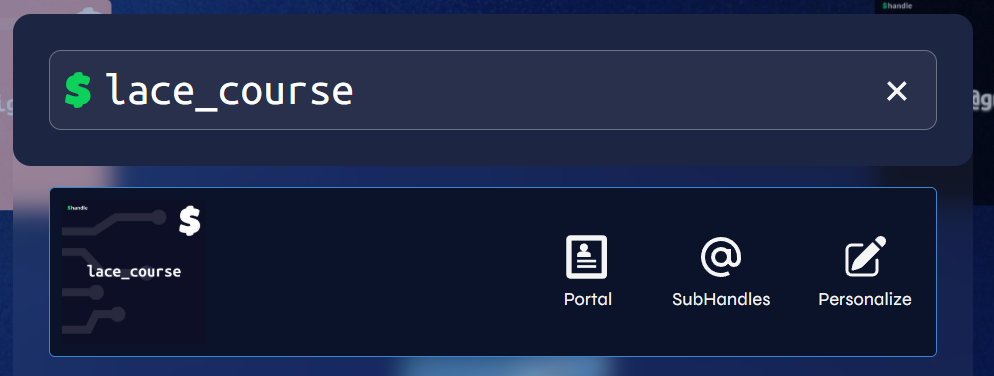

You can now check the NFT view in Lace to see your handle NFT.

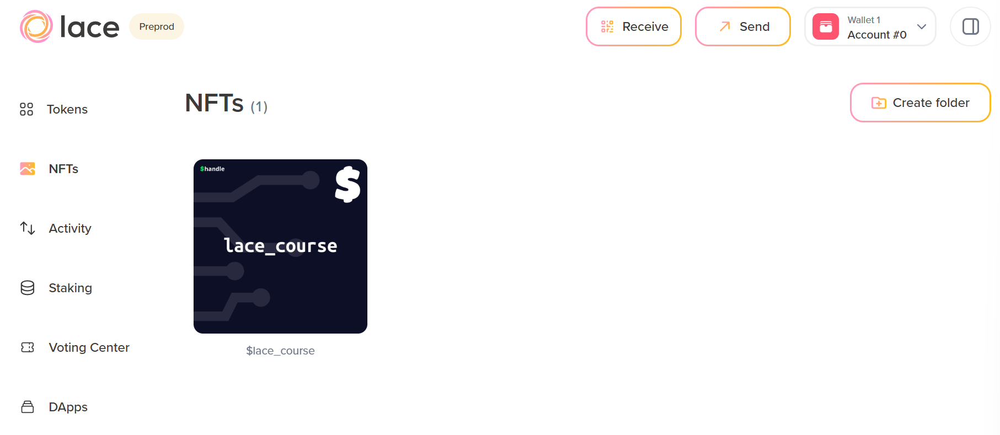

Clicking the NFT displays its details.

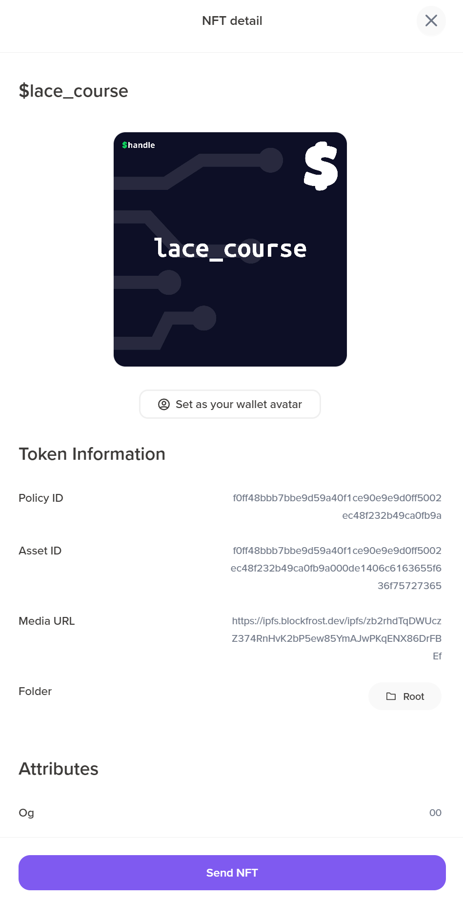

In Lace, click **Send** and enter $lace\_course in the recipient field. A green check mark appears, confirming the handle exists.

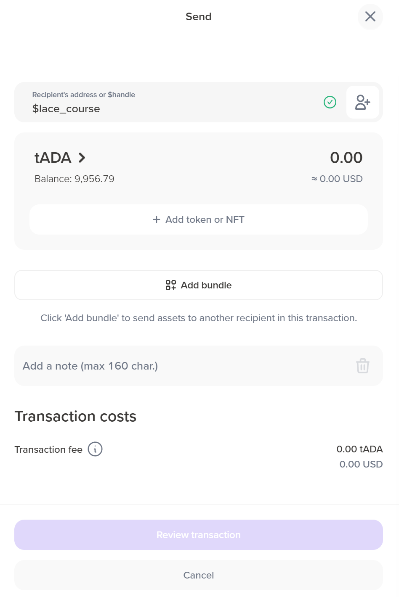

Since this is your own address, no funds need to be sent – you can close the transaction window. Others can use your handle to send you ada or tokens. Remember that handles created on a test network work only on that network – they do not work on mainnet. Always use handles with light or full-node wallets. Using a handle from an exchange may result in permanent funds loss.
