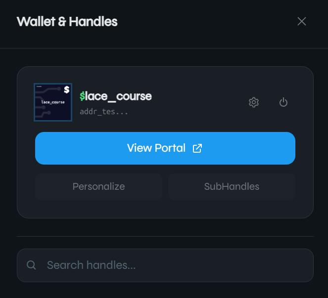
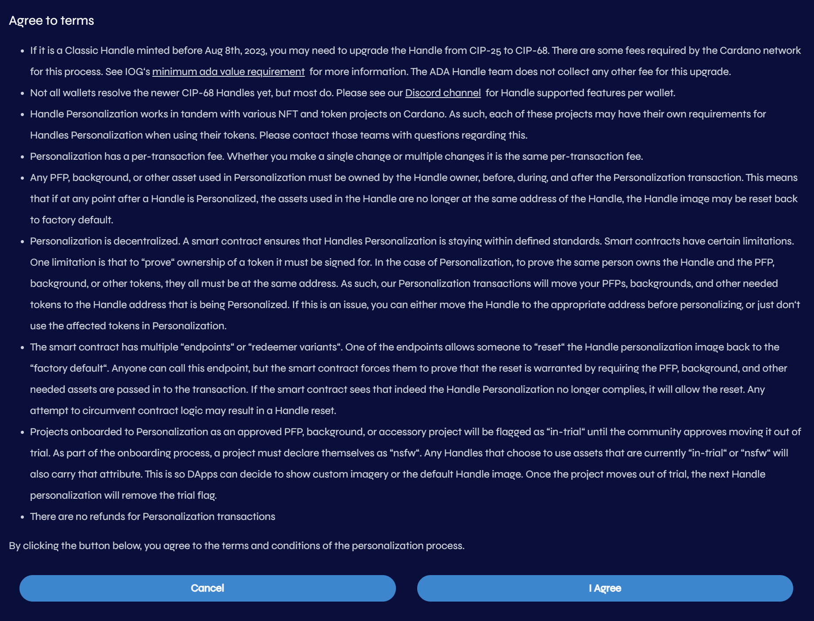
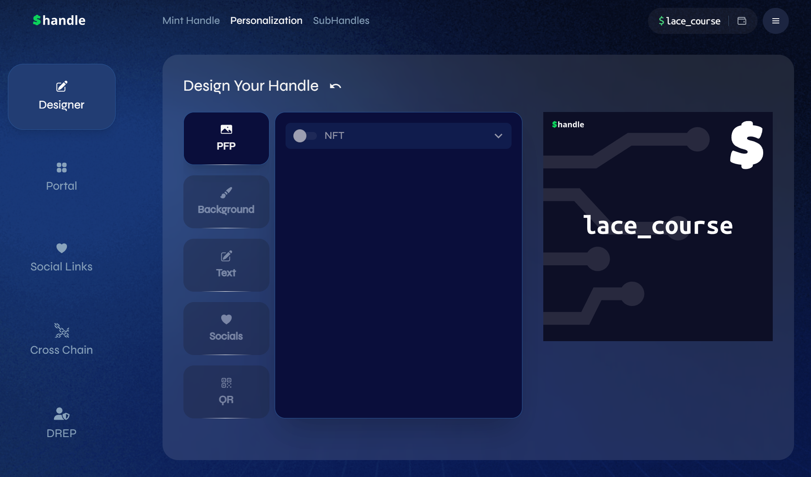

# 7.3 Benefits and ada handles personalization  

Ada handles have the following benefits:

* If a company is selling products or services for ada, users don’t have to copy a long address. They can simply remember a short handle standing for the company’s address.
* If, for some reason, the company wants to change its address, it can simply send the NFT to a new address, and nothing changes for end users.
* Handles are minted with the [CIP-68](https://cips.cardano.org/cip/CIP-68) standard, which specifies the datum metadata standard. This allows for handle personalization.  

Handles originally minted under the [CIP-25](https://cips.cardano.org/cip/CIP-25) standard can be upgraded at any time on [https://handle.me/](https://handle.me/) for four ada. This fee covers the blockchain cost of burning the CIP-25 handle and re-minting it under the CIP-68 standard in a single transaction.

Handles can be personalized, allowing users to customize them. On [https://handle.me](https://handle.me), personalization options include adding a profile picture (PFP), a background image, a QR code, social media links, or a shadow/ribbon to the handle text. Users can also change the background and border color of their handle. The company charges a flat fee of 10 ada every time a handle is personalized. Additional costs may apply if third-party background vendors are used. To maintain fair pricing as the value of ada changes, the company adjusts fees to support continued development while encouraging the community to continue using personalization features.  

To personalize a handle, go to the handle page and connect your wallet. The handle name should appear on the right side of the top bar.

Click the wallet icon next to the handle name. The *Wallet & Handles* window appears.

Click **Personalize**. The page asks you to agree to the terms and conditions of the personalization process. Click **I Agree**.

The personalization window opens.

The personalization settings modify how a handle is displayed in the wallet and also on the handle page. Under the *Designer* section, you can add a profile picture (PFP), background colors, shadow, or the ribbon of your text, along with social media links and a QR code. The *Portal* section allows you to choose an option to determine how to display your handle page. The *Social Links* section allows adding links to your social media. The *Cross Chain* section allows adding cross-chain addresses. Finally, the *DREP* section will display DRep information.

Modification of handle names is not allowed. If you want to change your handle name to another available name, the best option is to purchase a new handle. The new handle can exist alongside the old handle at the same address, with both resolving correctly to that address.
